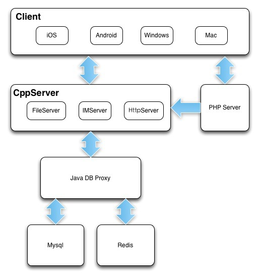
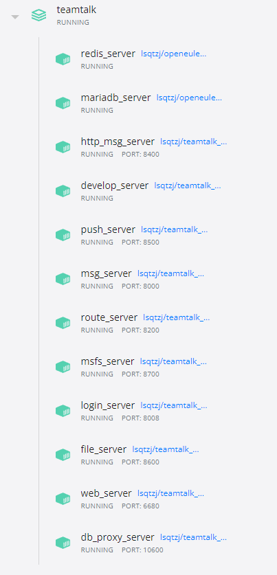

[toc]

> 项目整理了 TeamTalk 一些相关资源，资源大部分来源于网络，时间原因尚未将所有引用链接与作者列出，后续将明确列出。
>
> 根据 doc 目录下的 “windows 10 Docker Desktop TeamTalk 安装笔记” 一文，现已成功部署 server，iOS、Android 客户端经过升级也可以正常运行，但尚未验证是否能与服务端正常通信。
>
> TeamTalk 官方声明将原有github地址 https://github.com/mogutt 变更为 https://github.com/mogujie/TeamTalk， 但上述两个地址均未能找到相关开源代码。


## 一、项目背景

蘑菇街能有今天的快速发展，得益于开源软件群雄崛起的大环境背景，我们一直对开源社区怀有感恩之情，因此也一直希望能为开源社区贡献一份力量。

2013年我们蘑菇街从社区导购华丽转身时尚电商平台，为解决千万妹子和时尚卖家的沟通问题，我们开发了自己的即时通讯软件。既然已经有了用户使用的IM，为什么我们自己公司内部沟通还要用第三方的呢？因此就有了TT(TeamTalk)的雏形，现在蘑菇街内部的在线沟通全部通过TT来完成。随着TT功能的逐渐完善，我们决定把TT开源来回馈开源社区，希望国内的中小企业都能用上开源、免费、好用的IM工具！


## 二、项目介绍

- 名称：TeamTalk
- 官网：http://tt.mogu.io/
- 开源协议：[Apache License, Version 2.0](http://www.apache.org/licenses/LICENSE-2.0.html)
- 定位：中小型企业用户，member >= 2
- 特点：开源与产品并重
- 功能：可靠的消息传递机制；支持文字、图片、语音等富文本信息；文件收发等
- 具体文档见doc目录下, 安装之前请仔细阅读相关文档。
  

## 三、项目框架

麻雀虽小五脏俱全，本项目涉及到多个平台、多种语言，简单关系如下图：



## 四、服务端

CppServer：TTCppServer工程，包括IM消息服务器、http服务器、文件传输服务器、文件存储服务器、登陆服务器 java DB Proxy：TTJavaServer工程，承载着后台消息存储、redis等接口 PHP server：TTPhpServer工程，teamtalk后台配置页面

### 4.1 服务端 Docker 支持

基于 openeuler/openeuler:20.03 系统的 docker 容器系统，方便快速调试。




### 4.2 直接运行版本

```
cd docker
docker-compose up -d
```


### 4.3 编译版本

```
cd docker
docker-compose -f "docker-compose-build.yml" up -d --build

# b'i/o timeout' 问题: 重复执行 docker-compose xxx 命令就可以解决。
```


### 4.4 命令行转换

```
下载:
https://sourceforge.net/projects/dos2unix/

命令行运行:
for /R %G in (*.c *.cc *.h *.mk *.cpp) do unix2dos "%G" 
```


### 4.5 linux换行问题

```
yum install dos2unix
find ./ -type f -print0 | xargs -0 dos2unix --
```


## 五、客户端

### 5.1 mac

TTMacClient工程，mac客户端工程

### 5.2 iOS

TTIOSClient工程，IOS客户端工程, 已更新到 Xcode 14.1

### 5.3 Android

TTAndroidClient工程，android客户端工程， 已更新到 Android Studio 2022.3.1

### 5.4 Windows

TTWinClient工程，windows客户端工程，更新到 Visual Studio 2019 (v142)  ISO C++17 标准 (/std:c++17)，win-cliient\solution\teamtalk.sln(需要管理员模式打开)。需要安装 vcpkg https://github.com/microsoft/vcpkg#quick-start-windows ，vcpkg install protobuf[core]:x86-windows，
protobuf    -> 3.18.0
protobuf 更新后可以替换/pb/protoc.exe 后重新运行make_PB_Files.bat 生成PB协议文件


## 六、语言

c++、objective-c、java、php


## 七、系统环境

Linux、Windows，Mac, iOS, Android


## 八、近期修改

- 消息采用加密存储。
- 包体采用pb。
- 聊天数据db 分表存储。
- 每条消息有唯一id。
- 多端消息同步。
- db_proxy用c++改写了。
- pc端可以播放语音。
- 消息计数多端同步。
- 新增push_server用于给iOS推送消息。
- 各个客户端登陆地址可配置。
- 修复若干bug。
- 去掉文件传输功能(后期可能加上)。
- 发现后台可以动态配置。


## 九、测试账户

如果只关心调试客户端，可以将默认服务器指向我们提供的测试服务器。
需要使用我们提供的测试服务器的，请将默认登陆服务器的地址填写为以下:
http://access.teamtalk.im:8080/msg_server
由于相关规定，暂时不提供自由注册。需要注册的用户，我们提供TT001-TT100共100个测试账户，密码统一为:test123，其余想开通的，请发邮件申请。

## 十、相关资源

- [http接口定义](./doc/http接口定义.md)

- [协议文件说明](./doc/协议文件说明.md)

- [协议文件说明pdf](./doc/mogutt-TTServer/TT_Client_protocol.pdf)

- [部署说明](./doc/部署说明.md)

- [windows 10 Docker Desktop TeamTalk 安装笔记](./doc/windows 10 Docker Desktop TeamTalk 安装笔记/README.md)
- [TeamTalk部署详细教程(最全最新TeamTalk部署教程助你一次部署成功)](./doc/TeamTalk部署详细教程(最全最新TeamTalk部署教程助你一次部署成功)/README.md)
- [TeamTalk各个服务的IP配置方案](./doc/TeamTalk各个服务的IP配置方案/README.md)

- [TeamTalk部署问题及解决方案](./doc/TeamTalk部署问题及解决方案/README.md)
- [TeamTalk WinClient编译问题及解决方案](./doc/TeamTalk WinClient编译问题及解决方案/README.md)
- [mogutt-TTServer](./doc/mogutt-TTServer/README.md)
- [关于TeamTalk](./doc/开源IM工程“蘑菇街TeamTalk”.md)