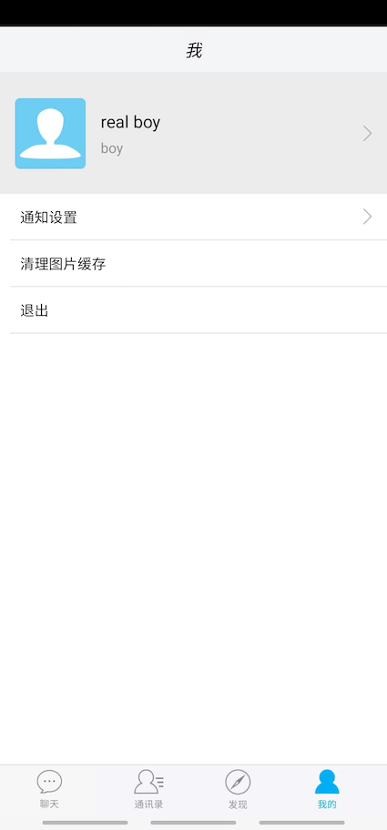

# TeamTalk

> 项目以 TeamTalk（蘑菇街的一个开源即时通讯解决方案）开源项目为基础，以更新、完善（整理网上与该项目相关的资料、记录阅读代码过程中的一些心得、添加新功能、添加详细的注释）该项目为主线，逐渐形成一套 C++ IM 系统解决方案的参考资料。
>
> 强烈推荐看本项目之前先详细学习一下[张远龙](https://github.com/balloonwj)所著《C++ 服务器开发精髓》一书，本人最初阅读 TeamTalk 项目源码时并不具备 C++ 网络编程、多线程工作经验，所以阅读代码过程中遇到了很多问题，只能边读边查，导致进度缓慢，而且非常容易陷入到细节中去导致无法对服务的整体架构有一个全面的了解。直到有幸收到好友赠送的《C++ 服务器开发精髓》一书，按照书中安排敲完一遍多线程编程、网络编程后再来看代码，发现此时基本不会陷入到技术细节中了，因为你会发现书中介绍的线程技术、网络编程都能在 TeamTalk 中找到影子，而且作者在书中多次提到了 TeamTalk。此外作者开发的 [flamingo](https://github.com/balloonwj/flamingo)是另一款开源 IM 系统，也是非常值得结合《C++ 服务器开发精髓》去读的。
>
> 
>
> 其它一些说明：
>
> 原[开源项目](https://github.com/mogutt)已经无法找到相关代码，本仓储最初版本（现master分支）从 <https://gitee.com/CyrusZHou/TeamTalk> fork 而来
>
> 阅读《C++ 服务器开发精髓》时，书中提到的 TeamTalk 与本项目代码略有不同，可以结合作者维护的 TeamTalk [版本](https://github.com/balloonwj/flamingo)阅读
>
> 参照4.1虚拟机单机手动部署方案，Android 与 IOS 现已可以正常运行
>
> 暂时没有PC客户端的维护计划


## 一、项目介绍

- 开源协议：[Apache License, Version 2.0](http://www.apache.org/licenses/LICENSE-2.0.html)
- 定位：中小型企业用户，member >= 2
- 特点：开源与产品并重
- 功能：可靠的消息传递机制；支持文字、图片、语音等富文本信息，支持文件收发等


## 二、分支说明

- master 分支与 <https://gitee.com/CyrusZHou/TeamTalk> 项目 master 分支代码一致；

- main、dev 分支为我本人维护的分支


## 三、项目架构


- login_server (C++): 登录服务器，分配一个负载小的 MsgServer 给客户端使用
- msg_server (C++):  消息服务器，提供客户端大部分信令处理功能，包括私人聊天、群组聊天等
- route_server (C++):  路由服务器，为登录在不同 MsgServer 的用户提供消息转发功能
- file_server (C++): 文件服务器，提供客户端之间得文件传输服务，支持在线以及离线文件传输
- msfs_server (C++): 图片存储服务器，提供头像，图片传输中的图片存储服务
- dbproxy_server (C++): 数据库代理服务器，提供 MySQL 以及 Redis 的访问服务，屏蔽其他服务器与 MySQL、Redis 的直接交互

详细的服务端代码解析 [TeamTalk源码分析(张小方)](./doc/TeamTalk源码分析(张小方)/README.md)

## 四、服务部署

项目提供3种部署方案：虚拟机单机手动部署、Docker 多容器单机部署、K8S 部署（计划中）。本人在对Android、IOS客户端源码进行修改的基础上，已完成虚拟机单机手动部署方案验证，可满足最基础的后台管理、聊天等需求；Docker 多容器单机部署各服务可正常运行，但尚未完成前后端连调，咱不能使用。

### 4.1 虚拟机单机手动部署

此方案经过验证可满足最基础的后台管理、聊天等需求，部署文档见 [Macmini+VMWare+CentOS7.9单机手动部署文档](./doc/Macmini+VMWare+CentOS7.9单机手动部署文档/README.md)

### 4.2 Docker 多容器单机部署

> Docker 多容器单机部署供了分别以 CentOS7.9.2009、Openeuler20.03(进行中)、Ubantu(计划中)、Debian(计划中) 为基础镜像的解决方案，目前仅 CentOS7.9.2009 方案可用。在使用 CentOS7.9.2009 进行部署时有一点需要注意，由于 login_server 返回的 ip 实际上是内网 ip，所以目前需要在客户端将 login_server 返回的地址中的 ip 手动改为与 login_server 相同的可供客户端访问的地址。
>
> 由于 CentOS 不再受官方支持，所以后续会增加其他 Linux 镜像支持

#### （1）直接拉取本项目制作好的镜像进行部署

```shell
cd docker
docker-compose up -f docker-compose-centos.yml -d
# 尚未完成
# docker-compose up -f docker-compose-openeuler.yml -d
```

#### （2） 自定义镜像运行服务

```Dockerfile
cd docker
docker-compose -f "docker-compose-build-centos.yml" up -d --build
# 尚未完成
# docker-compose -f "docker-compose-build-openeuler.yml" up -d --build
```


### 4.3 K8S 部署

计划中

## 五、客户端

### 5.1 IOS

工程位于本项目根目录下 ios 文件夹内，采用 OC 编写，已更新到 IOS 11，可使用 Xcode 14.1 打开运行，下面是部分功能截图：


### 5.2 Android

工程位于本项目根目录下 android 文件夹内，采用 Java 编写，已更新到 API 29（Java18、gradle8.1.0）可使用 Android Studio 2022.3.1打开运行，下面是部分功能截图：





### 5.3 Mac

工程位于本项目根目录下 mac 文件夹内，采用 OC 编写，只升级了 pb 文件，目前存在点击登录会崩溃的问题，其余未验证，暂时不打算维护

### 5.4 Windows

工程位于本项目根目录下 win-client 文件夹内，采用 C++17 & mfc 编写，未验证，暂时不打算维护

## 六、文档

- [协议文件说明](./pb/README.md)
- [TeamTalk源码分析(张小方)](./doc/TeamTalk源码分析(张小方)/README.md)
- [Macmini+VMWare+CentOS7.9单机手动部署文档](./doc/Macmini+VMWare+CentOS7.9单机手动部署文档/README.md)

## 七、TODO

- [x] 提供 VMware WorkStation + CentOS7.9 虚拟机单机部署方案
- [x] 提供 Docker(CentOS7.9) 多容器单机部署方案
- [ ] 提供基于 Docker(Openeuler) 的解决方案
- [ ] 提供基于 Docker(Debian) 的解决方案
- [ ] 提供基于 Docker(Ubantu) 的解决方案
- [ ] 提供 K8S 部署方案
- [x] 升级 Android 到 API 29
- [x] 解决 Android 上无法登录
- [x] 解决 Android 上点击联系人列表奔溃
- [ ] 解决 Android 上聊天点击发送图片无响应
- [ ] 解决 Android 上聊天点击语音退出登录
- [ ] 解决 Android 布局问题
- [x] 升级 IOS 到 IOS 11
- [x] 升级 IOS PB 到 3.x 版本
- [ ] 解决 IOS 上的布局适配问题
- [ ] 解决图片服务器连接问题
- [ ] Win 客户端验证（x）
- [ ] Mac 客户端验证（x）
- [ ] 开发 Web 版本客户端
- [ ] 管理后台用 React 重写
- [ ] Android 用 kotlin 重写
- [ ] IOS 用 swift 重写
- [ ] Flutter 版本
- [ ] 后端密码+盐值校验问题
- [ ] 后端返回部分地址错误(添加网关)
- [ ] 崩溃日志上传（传到自己的服务器）
- [x] 协议文件中的 FileType 重命名为 FileTypeX（Mac上枚举冲突）
- [ ] 完善单元测试
- [ ] 完善各客户端文档
- [ ] 解决 Docker 镜像体积太大问题
- [ ] 解决手动部署 PHP 服务开机没有自动启动问题
- [ ] 简化手动部署流程
- [ ] 添加内网论坛功能
- [ ] 添加用户个人注册功能
- [ ] 服务端各个服务之间线程类、缓冲区管理类等若干重复定义代码中优化
- [ ] 对照 flamingo 重构代码

## 八、参考链接

- <https://github.com/mogutt>
- <https://github.com/mogujie/TeamTalk>
- <https://github.com/lsqtzj/TeamTalk>
- <https://gitee.com/CyrusZHou/TeamTalk>
- <https://blog.csdn.net/lsqtzj/article/details/119456161>
- <https://blog.csdn.net/siyacaodeai/article/details/114982897>
- <https://blog.csdn.net/analogous_love/category_6901951.html>
- <https://blog.csdn.net/analogous_love/category_6503557.html>
