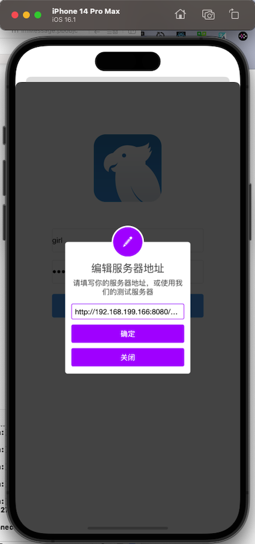
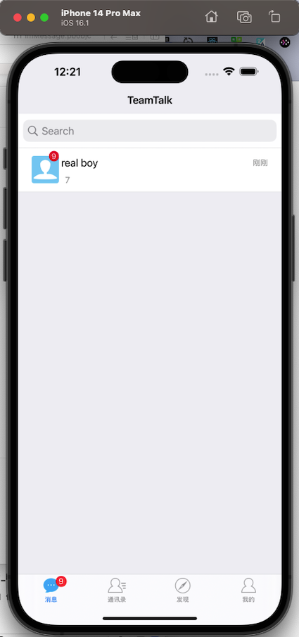
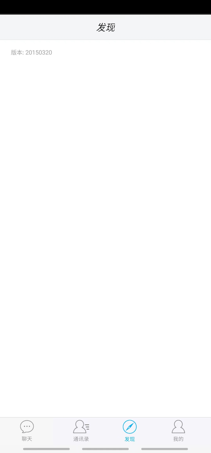
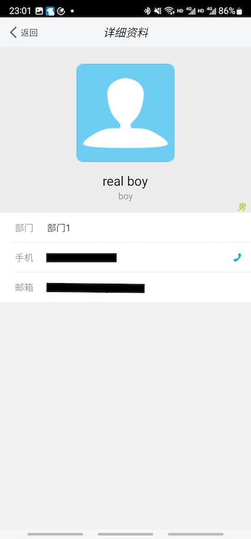

# TeamTalk

> 项目定位是学习 IM 系统需要的各种知识，并提供多个平台客户端实现
>
> 由于原始开源项目已经无法找到相关代码，本仓储最初版本从 <https://gitee.com/CyrusZHou/TeamTalk> 拷贝而来。除 <https://gitee.com/CyrusZHou/TeamTalk> 项目，另一个由张小方维护的项目 <https://github.com/balloonwj/TeamTalk> 也是很全面


## 一、项目介绍

- 开源协议：[Apache License, Version 2.0](http://www.apache.org/licenses/LICENSE-2.0.html)
- 定位：中小型企业用户，member >= 2
- 特点：开源与产品并重
- 功能：可靠的消息传递机制；支持文字、图片、语音等富文本信息，支持文件收发等


## 二、分支说明

- master 分支与 <https://gitee.com/CyrusZHou/TeamTalk> 项目 master 分支代码一致；

- main、dev 分支为我本人维护的分支


## 三、项目架构


<center>系统架构图 <a href="https://github.com/9527cpp/moguTTServer">图片来源</a></center>

- login_server (C++): 登录服务器，分配一个负载小的 MsgServer 给客户端使用
- msg_server (C++):  消息服务器，提供客户端大部分信令处理功能，包括私人聊天、群组聊天等
- route_server (C++):  路由服务器，为登录在不同 MsgServer 的用户提供消息转发功能
- file_server (C++): 文件服务器，提供客户端之间得文件传输服务，支持在线以及离线文件传输
- msfs_server (C++): 图片存储服务器，提供头像，图片传输中的图片存储服务
- dbproxy_server (C++): 数据库代理服务器，提供 MySQL 以及 Redis 的访问服务，屏蔽其他服务器与 MySQL、Redis 的直接交互

详细的服务端代码解析 [TeamTalk源码分析(张小方)](./doc/TeamTalk源码分析(张小方)/README.md)


## 四、服务部署

项目提供四种部署方案：虚拟机单机手动部署、Docker 单容器部署（TODO）、Docker 多容器单机部署、K8S 部署（TODO），其中虚拟机单机手动部署方案已经过验证，可满足最基础的后台管理、聊天等需求；Docker 多容器单机部署各服务可正常运行，但尚未完成前后端连调。

### 4.1 虚拟机单机手动部署

此方案经过验证可满足最基础的后台管理、聊天等需求，部署文档见 [Macmini+VMWare+CentOS7.9单机手动部署文档](./doc/Macmini+VMWare+CentOS7.9单机手动部署文档/README.md)

### 4.2 Docker 单容器部署

TODO

### 4.3 Docker 多容器单机部署

> 本项目提供了分别使用 Openeuler、CentOS7.9 为基础镜像的解决方案，运行 docker-compose xxx 命令时如果出现 b'i/o timeout' 问题，重复执行 docker-compose xxx 命令即可

#### （1）直接拉取本项目制作好的镜像进行部署

```shell
cd docker
docker-compose up -f docker-compose-centos.yml -d
# docker-compose up -f docker-compose-openeuler.yml -d
```

#### （2） 自定义镜像运行服务

```Dockerfile
cd docker
docker-compose -f "docker-compose-build-centos.yml" up -d --build
// docker-compose -f "docker-compose-build-openeuler.yml" up -d --build
```


## 五、客户端

### 5.1 IOS

工程位于本项目根目录下 ios 文件夹内，采用 OC 编写，已更新到 IOS 11，可使用 Xcode 14.1 打开运行，下面是部分功能截图：






### 5.2 Android

工程位于本项目根目录下 android 文件夹内，采用 Java 编写，已更新到 API 29（Java18、gradle8.1.0）可使用 Android Studio 2022.3.1打开运行，下面是部分功能截图：








### 5.3 Mac

工程位于本项目根目录下 mac 文件夹内，采用 OC 编写，只升级了 pb 文件，其余未验证

### 5.4 Windows

工程位于本项目根目录下 win-client 文件夹内，采用 C++17 & WFP 编写，未验证


## 六、文档

- [http接口定义](./doc/http接口定义.md)
- [协议文件说明](./doc/协议文件说明.md)、[协议文件说明pdf](./doc/mogutt-TTServer/TT_Client_protocol.pdf)


## 七、TODO

- [x] 提供 VMware WorkStation + CentOS7.9 虚拟机单机部署方案
- [ ] 提供 Docker 单容器部署方案
- [x] 提供 Docker 多容器单机部署方案
- [ ] 提供K8S 部署方案
- [x] 升级 Android 到 API 29
- [x] 解决 Android 上无法登录
- [x] 解决 Android 上点击联系人列表奔溃
- [ ] 解决 Android 上聊天点击发送图片无响应
- [ ] 解决 Android 上聊天点击语音退出登录
- [ ] 解决 Android 布局问题
- [x] 升级 IOS 到 IOS 11
- [x] 升级 IOS PB 到 3.x 版本
- [ ] 解决 IOS 上的布局适配问题
- [ ] 解决图片服务器连接问题
- [ ] Win 客户端验证
- [ ] Mac 客户端验证
- [ ] 开发 Web 版本客户端
- [ ] 管理后台用 React 重写
- [ ] Android 用 kotlin 重写
- [ ] IOS 用 swift 重写
- [ ] Flutter 版本
- [ ] 后端密码+盐值校验问题
- [ ] 后端返回部分地址错误
- [ ] 崩溃日志上传（传到自己的服务器）
- [ ] 协议文件中的 FileType 重命名为 FileTypeX（Mac上枚举冲突）
- [ ] 完善单元测试
- [ ] 完善各客户端文档
- [ ] 解决 Docker 镜像体积太大问题
- [ ] 解决 PHP 服务开机没有自动启动问题
- [ ] 简化手动部署流程
- [ ] 添加内网论坛功能
- [ ] 添加用户个人注册功能


## 八、参考链接

- <https://github.com/mogutt>
- <https://github.com/mogujie/TeamTalk>
- <https://github.com/lsqtzj/TeamTalk>
- <https://gitee.com/CyrusZHou/TeamTalk>
- <https://blog.csdn.net/lsqtzj/article/details/119456161>
- <https://blog.csdn.net/siyacaodeai/article/details/114982897>
- <https://blog.csdn.net/analogous_love/category_6901951.html>
- <https://blog.csdn.net/analogous_love/category_6503557.html>
