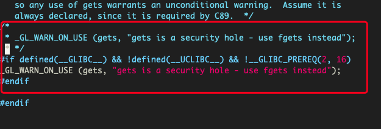
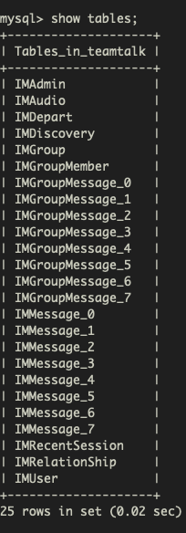
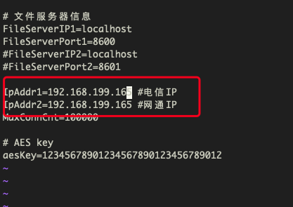
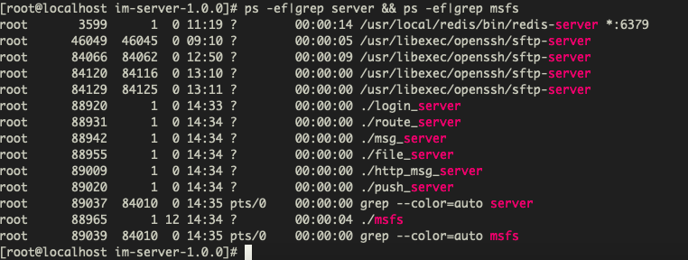
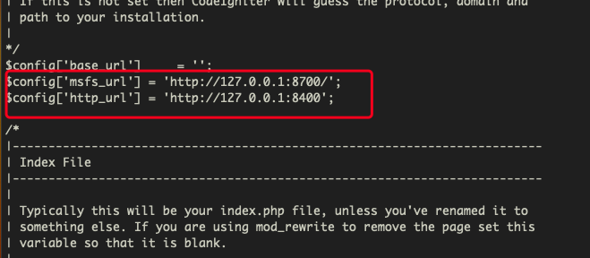
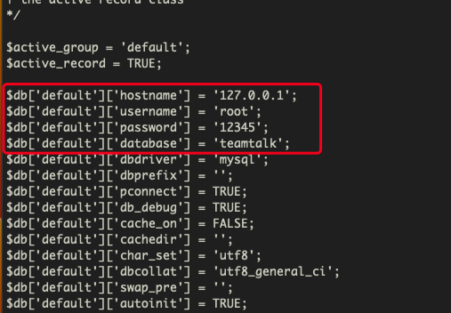
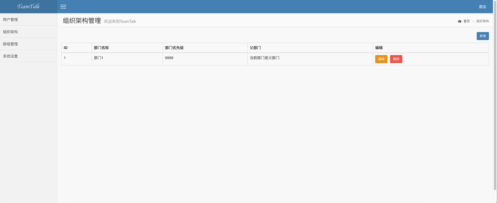
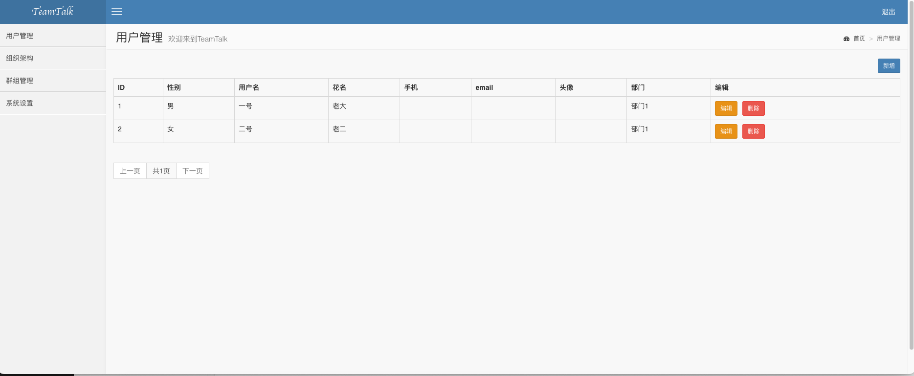

## 一、在 Macmini 上安装 VMWare

**Macmini 参数**

```
   apples-Mac-mini-1243:Desktop apple$ system_profiler SPHardwareDataType
    Hardware:
       Hardware Overview:
        Model Name: Mac mini
         Model Identifier: Macmini8,1
        Processor Name: 6-Core Intel Core i5
        Processor Speed: 3 GHz
        Number of Processors: 1
        Total Number of Cores: 6
        L2 Cache (per Core): 256 KB
        L3 Cache: 9 MB
        Memory: 8 GB
        System Firmware Version: 1916.40.8.0.0 (iBridge: 20.16.420.0.0,0)
        OS Loader Version: 564.40.4~27
        Serial Number (system): xxx
        Hardware UUID: xxx
        Provisioning UDID: xxx
        Activation Lock Status: Enabled
```

**VMware**

```
VMware Fusion
Professional Version 12.0.0 (16880131)
```


## 二、在虚拟机上安装 CentOS7.9

参数如下：

```
镜像：            CentOS-7-x86_64-DVD-2009.iso
网络模式：         Bridged Networking - Autodetect
内存：            4096MB
处理器核心数：      2 processor cores
磁盘：            20GB
语言：            US
```


## 三、安装基础环境

> 注意事项：刚开始安装时，gcc、cmake 直接使用 yum 默认安装的版本（使用 yum 默认安装的 gcc 版本为 4.8.5-44，cmake 版本为 2.8.12.2）就可以，不要提前升级，也不用 gdb。
>
> 在编译 TeamTalk 之前需要升级 gcc、cmake ，并安装 gdb

### 3.1 配置网络环境

CentOS7.9 安装后默认是不联网的，需要通过如下操作开启联网。必须先开启联网然后才能进行其他软件包的安装

```
vi /etc/sysconfig/network-scripts/ifcfg-ens33
```

将 `ONBOOT=no` 改为 `ONBOOT=yes`

然后启动网络服务

```
service network start
```

此时便可以使用 ping 命令或 ip address 来验证

### 3.2 更新系统

```
yum update -y
```

### 3.3 配置 SSH

- 安装 openssh-server

  CentOS7.9 默认情况下已经安装了 openssh-server，可用 `yum list installed | grep openssh-server` 查看 如果没安装可以使用 `yum install openssh-server` 命令安装

- 配置

  ```
  vi /etc/ssh/sshd_config
  ```

  将 Port、ListenAddress、PermitRootLogin、PasswordAuthentication 前面的注释删除

- 开启/重启 openssh-server

  ```
  systemctl restart sshd
  ```

- 使用 ssh 连接此服务器

  ```
  apples-Mac-mini-1243:~ apple$ ssh root@192.168.199.130
  root@192.168.199.130's password:
  Last login: Tue Dec  5 20:44:36 2023 from applesmini1243.lan
  ```

- 可能存在的问题

  - 如何查看虚拟机的内网地址

    ```
    ip address | grep 192
    ```

  - 之前使用 ssh 连接过相同 ip 的虚拟主机（后来虚拟主机删除了又重装），会出现如下错误，如果存在下面的问题，需要从 `/Users/apple/.ssh/known_hosts` 删除相应的记录:

    ```
    apples-Mac-mini-1243:Desktop apple$ ssh root@192.168.199.100
    @@@@@@@@@@@@@@@@@@@@@@@@@@@@@@@@@@@@@@@@@@@@@@@@@@@@@@@@@@@
    @    WARNING: REMOTE HOST IDENTIFICATION HAS CHANGED!     @
    @@@@@@@@@@@@@@@@@@@@@@@@@@@@@@@@@@@@@@@@@@@@@@@@@@@@@@@@@@@
    IT IS POSSIBLE THAT SOMEONE IS DOING SOMETHING NASTY!
    Someone could be eavesdropping on you right now (man-in-the-middle attack)!
    It is also possible that a host key has just been changed.
    The fingerprint for the ED25519 key sent by the remote host is
    SHA256:KJbaxnmIv182s4+0kJ2SzGy3Y/jIn2gWkP/Ubq/BUx8.
    Please contact your system administrator.
    Add correct host key in /Users/apple/.ssh/known_hosts to get rid of this message.
    Offending ED25519 key in /Users/apple/.ssh/known_hosts:14
    Host key for 192.168.199.100 has changed and you have requested strict checking.
    Host key verification failed.
    ```

  - 使用 ssh 连接成功后终端报如下错误

    ```
    -bash: warning: setlocale: LC_CTYPE: cannot change locale (UTF-8): No such file or directory
    ```

    解决方案：

    vi /etc/environment 加入如下代码

    ```
    LC_ALL=zh_CN.utf8
    LANG=zh_CN.utf8 
    ```

    下次 SSH 登陆的时候，就不会出现如上警告了， 而且使用 date 命令会发现已经支持了中文。

**安装完成ssh之后，后续的操作就可以通过 ssh 远程操作了**

### 3.4 测试 FTP

```
选用 FileZilla, 协议选择 SFTP
```

### 3.5 安装基础软件包

```
yum -y install net-tools initscripts wget vim git texinfo patch make cmake gcc gcc-c++ gcc-g77 flex bison file libtool libtool-libs autoconf kernel-devel libjpeg libjpeg-devel libpng libpng-devel libpng10 libpng10-devel gd gd-devel freetype freetype-devel libxml2 libxml2-devel zlib zlib-devel glib2 glib2-devel bzip2 bzip2-devel libevent libevent-devel ncurses ncurses-devel curl curl-devel e2fsprogs e2fsprogs-devel krb5 krb5-devel libidn libidn-devel openssl openssl-devel vim-minimal nano fonts-chinese gettext gettext-devel ncurses-devel gmp-devel pspell-devel unzip libcap diffutils zip libtool boost-devel nc lsof tcpdump
```

### 3.6 升级 Git

直接使用 yum install git 命令安装的 git 版本为 1.8.3.1，版本过低，在安装某些包时会因为不支持某些高级 git 命令而导致安装失败，因此需要安装高版本的 git

- 如果之前使用 yum 命令安装过，可以使用下面的命令卸载

  ```
  yum remove -y git
  yum remove -y git-*
  ```

- 在 CentOS7.9 上安装新版本 Git 最快的方法是通过 End Point 库（其他版本的 CentOS 替换成对应版本安装，可参考：packages.endpointdev.com/）

  ```
  yum install -y https://packages.endpointdev.com/rhel/7/os/x86_64/endpoint-repo.x86_64.rpm
  yum install -y git
  ```

- 验证 git 版本

  ```
  git --version
  ```

- 设置 git 快捷键

  ```
  git config --global color.ui true
  git config --global alias.st status
  git config --global alias.co checkout
  git config --global alias.ci commit
  git config --global alias.br branch
  git config --global alias.unstage 'reset HEAD'
  git config --global alias.last 'log -1'
  git config --global alias.lg "log --color --graph --pretty=format:'%Cred%h%Creset -%C(yellow)%d%Creset %s %Cgreen(%cr) %C(bold blue)<%an>%Creset' --abbrev-commit"
  ```

- 设置 git 用户

  ```
  git config --global user.name "LShuXin"
  git config --global user.email "1569663570@qq.com"
  ```


## 四、安装 MySQL

### 4.1 下载、解压、编译安装 MySQL

```cobol
cd /home

wget https://downloads.mysql.com/archives/get/p/23/file/mysql-5.6.45.tar.gz

tar -zxvf mysql-5.6.45.tar.gz     
cd mysql-5.6.45

cmake -DCMAKE_INSTALL_PREFIX=/usr/local/mysql -DEXTRA_CHARSETS=all -DDEFAULT_CHARSET=utf8 -DDEFAULT_COLLATION=utf8_general_ci -DWITH_READLINE=1 -DWITH_SSL=system -DWITH_ZLIB=system -DWITH_EMBEDDED_SERVER=1 -DENABLED_LOCAL_INFILE=1

make -j 2 && make install     
```

### 4.2 创建 MySQL 用户

```cobol
groupadd mysql

useradd -s /sbin/nologin -M -g mysql mysql
```

### 4.3 创建 my.cnf 配置

```cobol
vi /etc/my.cnf
      
# Example MySQL config file for medium systems.
# The following options will be passed to all MySQL clients
[client]
#password    = your_password
port        = 3306
socket      = /tmp/mysql.sock
default-character-set=utf8mb4

# Here follows entries for some specific programs
# The MySQL server

[mysqld]
bind-address = 0.0.0.0
port         = 3306
socket       = /tmp/mysql.sock
datadir = /usr/local/mysql/var
collation-server = utf8mb4_general_ci
character-set-server = utf8mb4
skip-external-locking
key_buffer_size = 16M
max_allowed_packet = 1M
table_open_cache = 64
sort_buffer_size = 512K
net_buffer_length = 8K
read_buffer_size = 256K
read_rnd_buffer_size = 512K
myisam_sort_buffer_size = 8M

# Replication Master Server (default)
# binary logging is required for replication
log-bin=mysql-bin

# binary logging format - mixed recommended
binlog_format=mixed

# required unique id between 1 and 2^32 - 1
# defaults to 1 if master-host is not set
# but will not function as a master if omittedserver-id   = 1

# Uncomment the following if you are using InnoDB tablesinnodb_data_home_dir = /usr/local/mysql/varinnodb_data_file_path = ibdata1:10M:autoextendinnodb_log_group_home_dir = /usr/local/mysql/var

# You can set .._buffer_pool_size up to 50 - 80 %
# of RAM but beware of setting memory usage too highinnodb_buffer_pool_size = 16Minnodb_additional_mem_pool_size = 2M
# Set .._log_file_size to 25 % of buffer pool sizeinnodb_log_file_size = 5Minnodb_log_buffer_size = 8Minnodb_flush_log_at_trx_commit = 1
innodb_lock_wait_timeout = 50

[mysqldump]
quickmax_allowed_packet = 16M

[mysql]
no-auto-rehash

# Remove the next comment character if you are not familiar with SQL
#safe-updatesdefault-character-set=utf8mb4

[myisamchk]
key_buffer_size = 20Ms
ort_buffer_size = 20M
read_buffer = 2M
write_buffer = 2M

[mysqlhotcopy]
interactive-timeout
```

### 4.5 初始化

```cobol
/usr/local/mysql/scripts/mysql_install_db --defaults-file=/etc/my.cnf --basedir=/usr/local/mysql --datadir=/usr/local/mysql/var --user=mysql

chown -R mysql /usr/local/mysql/var

chgrp -R mysql /usr/local/mysql/.

cp support-files/mysql.server /etc/init.d/mysql

chmod 755 /etc/init.d/mysql
```

### 4.6 其他配置

```cobol
vi /etc/ld.so.conf.d/mysql.conf
```

输入以下内容

```cobol
/usr/local/mysql/lib
/usr/local/lib
```

应用配置

```undefined
ldconfig

ln -s /usr/local/mysql/lib/mysql /usr/lib/mysql

ln -s /usr/local/mysql/include/mysql /usr/include/mysql

ln -s /usr/local/mysql/bin/mysql /usr/bin/mysql

ln -s /usr/local/mysql/bin/mysqldump /usr/bin/mysqldump

ln -s /usr/local/mysql/bin/myisamchk /usr/bin/myisamchk

ln -s /usr/local/mysql/bin/mysqld_safe /usr/bin/mysqld_safe
```

### 4.7 启动mysql

```cobol
/etc/init.d/mysql start
```

### 4.8 修改密码

> 直接在上面的配置文件中设置密码会失败

空密码登录

```undefined
mysql -uroot
```

 sql命令

```sql
use mysql;

update user set password=password('12345') where user='root';
flush privileges;

// 解决只能在本机登录的问题
update user set host='%' where user='root';

exit
```

新密码登录 

```cobol
mysql -uroot -p12345
exit
cd /home
```

### 4.9 设置开机启动

```
chkconfig --level 345 mysql on
```


## 五、安装 PHP5.3.28

### 5.1 安装 libiconv 依赖

下载解压libiconv

```cobol
cd /home
wget http://ftp.gnu.org/pub/gnu/libiconv/libiconv-1.14.tar.gz
tar -zxvf libiconv-1.14.tar.gz
cd libiconv-1.14
```

vi srclib/stdio.in.h 文件，避免如下 error: ‘gets’

```cobol
In file included from progname.c:26:0:
./stdio.h:1010:1: error: ‘gets’ undeclared here (not in a function)
 _GL_WARN_ON_USE (gets, "gets is a security hole - use fgets instead");
vim srclib/stdio.in.h
```

 注释698行，添加如下3行

```cobol
#if defined(__GLIBC__) && !defined(__UCLIBC__) && !__GLIBC_PREREQ(2, 16)
_GL_WARN_ON_USE (gets, "gets is a security hole - use fgets instead");
#endif
```



编译安装 libiconv

```cobol
./configure
make -j 2 && make install
```

### 5.2 安装 libmcrypt 依赖

```cobol
cd /home
wget https://sourceforge.net/projects/mcrypt/files/Libmcrypt/2.5.8/libmcrypt-2.5.8.tar.gz
tar -zxvf libmcrypt-2.5.8.tar.gz
cd libmcrypt-2.5.8/
./configure
make -j2 && make install
ldconfig
cd libltdl/
./configure --enable-ltdl-install
make -j2 && make install
```

### 5.3 安装 mhash 依赖

```cobol
cd /home
wget https://sourceforge.net/projects/mhash/files/latest/download/mhash-0.9.9.9.tar.gz
tar -xf mhash-0.9.9.9.tar.gz
cd mhash-0.9.9.9
./configure
make -j2 && make install
```

### 5.4 安装PHP

#### 5.4.1 安装PHP

```cobol
cd /home
wget https://www.php.net/distributions/php-5.3.28.tar.gz
tar -zxvf php-5.3.28.tar.gz
cd php-5.3.28
./configure --prefix=/usr/local/php --with-config-file-path=/usr/local/php/etc --enable-fpm --with-fpm-user=www --with-fpm-group=www --with-mysql=mysqlnd --with-mysqli=mysqlnd --with-pdo-mysql=mysqlnd --with-iconv-dir --with-freetype-dir --with-jpeg-dir --with-png-dir --with-zlib --with-libxml-dir=/usr --enable-xml --disable-rpath --enable-magic-quotes --enable-safe-mode --enable-bcmath --enable-shmop --enable-sysvsem --enable-inline-optimization --with-curl --enable-mbregex --enable-mbstring --with-mcrypt --enable-ftp --with-gd --enable-gd-native-ttf --with-openssl --with-mhash --enable-pcntl --enable-sockets --with-xmlrpc --enable-zip --enable-soap --without-pear --with-gettext --disable-fileinfo
make -j2 ZEND_EXTRA_LIBS='-liconv' && make install
```

#### 5.4.2 配置PHP 

```cobol
cp php.ini-production /usr/local/php/etc/php.ini
sed -i 's/post_max_size = 8M/post_max_size = 50M/g' /usr/local/php/etc/php.ini
sed -i 's/upload_max_filesize = 2M/upload_max_filesize = 50M/g' /usr/local/php/etc/php.ini
sed -i 's/;date.timezone =/date.timezone = PRC/g' /usr/local/php/etc/php.ini
sed -i 's/short_open_tag = Off/short_open_tag = On/g' /usr/local/php/etc/php.ini
sed -i 's/; cgi.fix_pathinfo=1/cgi.fix_pathinfo=0/g' /usr/local/php/etc/php.ini
sed -i 's/; cgi.fix_pathinfo=0/cgi.fix_pathinfo=0/g' /usr/local/php/etc/php.ini
sed -i 's/;cgi.fix_pathinfo=1/cgi.fix_pathinfo=0/g' /usr/local/php/etc/php.ini
sed -i 's/max_execution_time = 30/max_execution_time = 300/g' /usr/local/php/etc/php.ini
sed -i 's/register_long_arrays = On/;register_long_arrays = On/g' /usr/local/php/etc/php.ini
sed -i 's/magic_quotes_gpc = On/;magic_quotes_gpc = On/g' /usr/local/php/etc/php.ini
sed -i 's/disable_functions =.*/disable_functions = passthru,exec,system,chroot,scandir,chgrp,chown,shell_exec,proc_open,proc_get_status,ini_alter,ini_restore,dl,openlog,syslog,readlink,symlink,popepassthru,stream_socket_server/g' /usr/local/php/etc/php.ini
ln -s /usr/local/php/bin/php /usr/bin/php
ln -s /usr/local/php/bin/phpize /usr/bin/phpize
ln -s /usr/local/php/sbin/php-fpm /usr/bin/php-fpm
```

#### 5.4.3 安装 ZendGuardLoader

```cobol
cd /home
mkdir -p /usr/local/zend/
wget http://downloads.zend.com/guard/5.5.0/ZendGuardLoader-php-5.3-linux-glibc23-x86_64.tar.gz
tar -zxvf ZendGuardLoader-php-5.3-linux-glibc23-x86_64.tar.gz
cp ZendGuardLoader-php-5.3-linux-glibc23-x86_64/php-5.3.x/ZendGuardLoader.so /usr/local/zend/
```

#### 5.4.4 编辑 php.ini 

```cobol
vi /usr/local/php/etc/php.ini
      
// 在最后添加如下内容
[Zend Optimizer]
zend_extension=/usr/local/zend/ZendGuardLoader.so
zend_loader.enable=1
zend_loader.disable_licensing=0
zend_loader.obfuscation_level_support=3
zend_loader.license_path=
```

#### 5.4.5 创建 php-fpm.conf

```cobol
vi /usr/local/php/etc/php-fpm.conf
      
// 内容如下
[global]
pid = /usr/local/php/var/run/php-fpm.pid
error_log = /usr/local/php/var/log/php-fpm.log
log_level = notice

[www]
listen = /tmp/php-cgi.sock
listen.backlog = -1
listen.allowed_clients = 127.0.0.1
listen.owner = www
listen.group = www
listen.mode = 0666
user = www
group = www
pm = dynamic
pm.max_children = 10
pm.start_servers = 2
pm.min_spare_servers = 1
pm.max_spare_servers = 6
request_terminate_timeout = 100
request_slowlog_timeout = 0
slowlog = var/log/slow.log
```

#### 5.4.6 创建 php-fpm 启动脚本

```cobol
vi /etc/init.d/php-fpm

// 内容如下
#! /bin/sh
 
### BEGIN INIT INFO
# Provides:          php-fpm
# Required-Start:    $remote_fs $network
# Required-Stop:     $remote_fs $network
# Default-Start:     2 3 4 5
# Default-Stop:      0 1 6
# Short-Description: starts php-fpm
# Description:       starts the PHP FastCGI Process Manager daemon
### END INIT INFO
prefix=/usr/local/php
exec_prefix=${prefix}
php_fpm_BIN=${exec_prefix}/sbin/php-fpm
php_fpm_CONF=${prefix}/etc/php-fpm.conf
php_fpm_PID=${prefix}/var/run/php-fpm.pid
php_opts="--fpm-config $php_fpm_CONF --pid $php_fpm_PID"
 
wait_for_pid () {
        try=0
        while test $try -lt 35 ; do
                case "$1" in
                        'created')
                        if [ -f "$2" ] ; then
                                try=''
                                break
                        fi
                        ;;
                        'removed')
                        if [ ! -f "$2" ] ; then
                                try=''
                                break
                        fi
                        ;;
                esac
                echo -n .
                try=`expr $try + 1`
                sleep 1
        done
}
 
case "$1" in
        start)
                echo -n "Starting php-fpm "
                $php_fpm_BIN --daemonize $php_opts
                if [ "$?" != 0 ] ; then
                        echo " failed"
                        exit 1
                fi
                wait_for_pid created $php_fpm_PID
 
                if [ -n "$try" ] ; then
                        echo " failed"
                        exit 1
                else
                        echo " done"
                fi
        ;;
        stop)
                echo -n "Gracefully shutting down php-fpm "
 
                if [ ! -r $php_fpm_PID ] ; then
                        echo "warning, no pid file found - php-fpm is not running ?"
                        exit 1
                fi
 
                kill -QUIT `cat $php_fpm_PID`
 
                wait_for_pid removed $php_fpm_PID
 
                if [ -n "$try" ] ; then
                        echo " failed. Use force-quit"
                        exit 1
                else
                        echo " done"
                fi
        ;;
 
        force-quit)
                echo -n "Terminating php-fpm "
 
                if [ ! -r $php_fpm_PID ] ; then
                        echo "warning, no pid file found - php-fpm is not running ?"
                        exit 1
                fi
                kill -TERM `cat $php_fpm_PID`
                wait_for_pid removed $php_fpm_PID
 
                if [ -n "$try" ] ; then
                        echo " failed"
                        exit 1
                else
                        echo " done"
                fi
        ;;
        restart)
                $0 stop
                $0 start
        ;;
        reload)
                echo -n "Reload service php-fpm "
                if [ ! -r $php_fpm_PID ] ; then
                        echo "warning, no pid file found - php-fpm is not running ?"
                        exit 1
                fi
                kill -USR2 `cat $php_fpm_PID`
 
                echo " done"
        ;;
        *)
                echo "Usage: $0 {start|stop|force-quit|restart|reload}"
                exit 1
        ;;
 
esac
```

授权 

```cobol
chmod +x /etc/init.d/php-fpm
```

#### 5.4.7 启动 php-fpm，并设置开机启动

**启动**

```cobol
groupadd www
useradd -s /sbin/nologin -g www www
/etc/init.d/php-fpm start
```

**设置开机启动**

```cobol
vi /etc/systemd/system/php-fpm.service
      
// 内容如下
[Unit]
Description=php-fpm
After=network.target
      
[Service]
Type=forking
ExecStart=/etc/init.d/php-fpm
PrivateTmp=true
User=www
Group=www

[Install]
WantedBy=multi-user.target
```

然后运行如下命令

```
systemctl enable php-fpm.service
chkconfig --level 345 php-fpm on
```


## 六、安装 Nginx

### 6.1 安装 pcre 依赖

```
cd /home
wget https://sourceforge.net/projects/pcre/files/pcre/8.39/pcre-8.39.tar.bz2
tar -jxvf pcre-8.39.tar.bz2
cd pcre-8.39
./configure
make -j2 && make install
```

### 6.2 安装 Nginx

```
cd /home
wget http://mirrors.sohu.com/nginx/nginx-1.6.0.tar.gz
tar -zxvf nginx-1.6.0.tar.gz
cd nginx-1.6.0
./configure --user=www --group=www --prefix=/usr/local/nginx --with-http_stub_status_module --with-http_ssl_module --with-http_gzip_static_module --with-ipv6
make -j2 && make install
ln -s /usr/local/nginx/sbin/nginx /usr/bin/nginx
```

### 6.3 编写 Nginx 配置文件

```
rm -f /usr/local/nginx/conf/nginx.conf
vi /usr/local/nginx/conf/nginx.conf

# 内容如下
user  www www;
worker_processes auto;

error_log  /home/wwwlogs/nginx_error.log  crit;
pid        /usr/local/nginx/logs/nginx.pid;

#Specifies the value for maximum file descriptors that can be opened by this process.
worker_rlimit_nofile 51200;

events {
    use epoll;
    worker_connections 51200;
    multi_accept on;
}


http {
    include       mime.types;
    default_type  application/octet-stream;
    server_names_hash_bucket_size 128;
    client_header_buffer_size 32k;
    large_client_header_buffers 4 32k;
    client_max_body_size 50m;
    sendfile on;
    tcp_nopush     on;
    keepalive_timeout 60;
    tcp_nodelay on;
    fastcgi_connect_timeout 300;
    fastcgi_send_timeout 300;
    fastcgi_read_timeout 300;
    fastcgi_buffer_size 64k;
    fastcgi_buffers 4 64k;
    fastcgi_busy_buffers_size 128k;
    fastcgi_temp_file_write_size 256k;

    gzip on;
    gzip_min_length  1k;
    gzip_buffers     4 16k;
    gzip_http_version 1.0;
    gzip_comp_level 2;
    gzip_types       text/plain application/x-javascript text/css application/xml;

    gzip_vary on;
    gzip_proxied        expired no-cache no-store private auth;
    gzip_disable        "MSIE [1-6]\.";

    server_tokens off;


    #log_format  access  '$remote_addr - $remote_user [$time_local] "$request" ''$status $body_bytes_sent "$http_referer" ''"$http_user_agent" $http_x_forwarded_for';

    log_format  access  '$remote_addr - $remote_user [$time_local] "$request" '
                        '$status $body_bytes_sent "$http_referer" '
                        '"$http_user_agent" $http_x_forwarded_for "$upstream_addr" "$upstream_response_time" $request_time $content_length';

    server {
        listen       80;
        server_name localhost;
        index index.html index.htm index.php default.html default.htm default.php;
        root        /home/wwwroot/default;

        location ~ \.php($|/) {
            fastcgi_pass   unix:/tmp/php-cgi.sock;
            fastcgi_index  index.php;
            fastcgi_split_path_info ^(.+\.php)(.*)$;
            fastcgi_param   PATH_INFO $fastcgi_path_info;
            fastcgi_param  SCRIPT_FILENAME  $document_root$fastcgi_script_name;
            include        fastcgi_params;
        }

        location ~ .*\.(gif|jpg|jpeg|png|bmp|swf)$ {
            expires      30d;
        }


        location ~ .*\.(js|css)?$ {
            expires      12h;
        }


        if (!-e $request_filename) {
            rewrite ^/(.*)$ /index.php/$1 last;
            break;
        }
    }
}
```

### 6.4 配置目录权限

```
mkdir -p /home/wwwroot/default
chmod +w /home/wwwroot/default
mkdir -p /home/wwwlogs
chmod 777 /home/wwwlogs
chown -R www:www /home/wwwroot/default
```

### 6.5 创建 Nginx 启动脚本

```
vi /etc/init.d/nginx

// 内容如下
#!/bin/sh
# chkconfig: 2345 55 25
# Description: Startup script for nginx webserver on Debian. Place in /etc/init.d and
# run 'update-rc.d -f nginx defaults', or use the appropriate command on your
# distro. For CentOS/Redhat run: 'chkconfig --add nginx'
### BEGIN INIT INFO# Provides:          nginx
# Required-Start:    $all
# Required-Stop:     $all
# Default-Start:     2 3 4 5
# Default-Stop:      0 1 6
# Short-Description: starts the nginx web server# Description:       starts nginx using start-stop-daemon
### END INIT INFO
# Author:   licess
# website:  http://lnmp.org


PATH=/usr/local/sbin:/usr/local/bin:/sbin:/bin:/usr/sbin:/usr/bin
NAME=nginx
NGINX_BIN=/usr/local/nginx/sbin/$NAME
CONFIGFILE=/usr/local/nginx/conf/$NAME.conf
PIDFILE=/usr/local/nginx/logs/$NAME.pid
SCRIPTNAME=/etc/init.d/$NAME

case "$1" in
    start)
        echo -n "Starting $NAME... "
        if netstat -tnpl | grep -q nginx;
        then
            echo "$NAME (pid `pidof $NAME`) already running."
            exit 1
        fi

        $NGINX_BIN -c $CONFIGFILE

        if [ "$?" != 0 ]; 
        then
            echo " failed"
            exit 1
        else
            echo " done"
        fi
        ;;

    stop)
        echo -n "Stoping $NAME... "
        if ! netstat -tnpl | grep -q nginx; 
        then
            echo "$NAME is not running."
            exit 1
        fi

        $NGINX_BIN -s stop

        if [ "$?" != 0 ];
        then
            echo " failed. Use force-quit"
            exit 1
        else
            echo " done"
        fi
        ;;

    status)
        if netstat -tnpl | grep -q nginx;
        then
            PID=`pidof nginx`
            echo "$NAME (pid $PID) is running..."
        else
            echo "$NAME is stopped"
            exit 0
        fi
        ;;

    force-quit)
        echo -n "Terminating $NAME... "

        if ! netstat -tnpl | grep -q nginx; 
        then
            echo "$NAME is not running."
            exit 1
        fi

        kill `pidof $NAME`

        if [ "$?" != 0 ]; 
        then
            echo " failed"
            exit 1
        else
            echo " done"
        fi
        ;;

    restart)
        $SCRIPTNAME stop
        sleep 1
        $SCRIPTNAME start
        ;;

    reload)
        echo -n "Reload service $NAME... "
        if netstat -tnpl | grep -q nginx; 
        then 
            $NGINX_BIN -s reload
            echo " done"
        else
            echo "$NAME is not running, can't reload."
            exit 1
        fi
        ;;

    configtest)
        echo -n "Test $NAME configure files... "
        $NGINX_BIN -t
        ;;

    *)
        echo "Usage: $SCRIPTNAME {start|stop|force-quit|restart|reload|status|configtest}"
        exit 1
        ;;
esac
```

授权

```
chmod +x /etc/init.d/nginx
```

启动

```
/etc/init.d/nginx start
```

### 6.6 设置开机启动

```
chkconfig --level 345 nginx on
```


## 七、安装 Redis

### 7.1 安装 Redis

```
cd /home
wget http://download.redis.io/releases/redis-2.8.19.tar.gz
tar -zxvf redis-2.8.19.tar.gz
cd redis-2.8.19
make PREFIX=/usr/local/redis install
```

### 7.2 配置 Redis

```
mkdir -p /usr/local/redis/etc/
cp redis.conf  /usr/local/redis/etc/redis.conf
sed -i 's/daemonize no/daemonize yes/g' /usr/local/redis/etc/redis.conf
```

### 7.3 创建 Redis 启动文件

```
vi /etc/init.d/redis

// 内容如下
#! /bin/bash

## redis - this script starts and stops the redis-server daemon

## chkconfig:    2345 80 90
# description:  Redis is a persistent key-value database##

## BEGIN INIT INFO
# Provides:          redis
# Required-Start:    $syslog
# Required-Stop:     $syslog# Should-Start:        $local_fs# Should-Stop:        $local_fs
# Default-Start:     2 3 4 5
# Default-Stop:      0 1 6
# Short-Description:    redis-server daemon
# Description:        redis-server daemon
### END INIT INFO

# chkconfig:   2345 90 10
# description:  Redis is a persistent key-value database


REDISPORT=6379

EXEC=/usr/local/redis/bin/redis-server

REDIS_CLI=/usr/local/redis/bin/redis-cli

PIDFILE=/var/run/redis.pid

CONF="/usr/local/redis/etc/redis.conf"


case "$1" in
    start)
        if [ -f $PIDFILE ]
        then
            echo "$PIDFILE exists, process is already running or crashed"
        else
            echo "Starting Redis server..."
            $EXEC $CONF
        fi

        if [ "$?"="0" ]
        then
            echo "Redis is running..."
        fi
        ;;

    stop)
        if [ ! -f $PIDFILE ]
        then
            echo "$PIDFILE does not exist, process is not running"
        else
            PID=$(cat $PIDFILE)
            echo "Stopping ..."
            $REDIS_CLI -p $REDISPORT shutdown

            while [ -x ${PIDFILE} ]
            do
                echo "Waiting for Redis to shutdown ..."
                sleep 1
            done

            echo "Redis stopped"
        fi
        ;;

   restart)
        ${0} stop
        ${0} start
        ;;

  *)  
    echo "Usage: /etc/init.d/redis {start|stop|restart}" >&2
    exit 1

esac
```

授权

```
chmod +x /etc/init.d/redis
```

启动

```
/etc/init.d/redis start
```

### 7.4 设置开机启动

```
chkconfig --level 345 redis on
```


## 八、安装 termcap

```
cd /home
wget https://mirrors.sjtug.sjtu.edu.cn/gnu/termcap/termcap-1.3.1.tar.gz
tar -zxvf termcap-1.3.1.tar.gz
cd termcap-1.3.1
./configure --prefix=/usr
make -j2 && make install
```


## 九、安装 gdb、CMake、boost-devel，升级 gcc

### 9.1 安装 gdb

```
cd /home
wget http://ftp.gnu.org/gnu/gdb/gdb-7.9.tar.gz
tar -zxvf gdb-7.9.tar.gz
cd gdb-7.9
./configure --prefix=/usr
make -j2 && make install
```

验证

```
gdb --version
```

### 9.2 安装 CMake

```
cd /home
wget -c https://github.com/Kitware/CMake/releases/download/v3.27.1/cmake-3.27.1.tar.gz
yum remove -y cmake
tar -zxvf cmake-3.27.1.tar.gz
cd cmake-3.27.1
./configure --prefix=/usr/local/cmake
gmake && gmake install
ln -s /usr/local/cmake/bin/cmake /usr/bin/cmake
```

添加环境变量

```
vi /etc/profile

export CMAKE_HOME=/usr/local/cmake
export PATH=$PATH:$CMAKE_HOME/bin

source /etc/profile
```

验证

 ```
 cmake --version
 ```

### 9.3 安装 boost-devel 
```
yum install -y boost-devel
```

 ### 9.4 升级 gcc

删除使用 yum install 命令安装的 gcc，重新安装

```
yum remove -y gcc
yum install -y centos-release-scl
yum install -y devtoolset-11-gcc devtoolset-11-gcc-c++
scl enable devtoolset-11 bash
```

验证安装

```
[root@localhost home]# gcc -v
Using built-in specs.
COLLECT_GCC=gcc
COLLECT_LTO_WRAPPER=/opt/rh/devtoolset-11/root/usr/libexec/gcc/x86_64-redhat-linux/11/lto-wrapper
Target: x86_64-redhat-linux
Configured with: ../configure --enable-bootstrap --enable-languages=c,c++,fortran,lto --prefix=/opt/rh/devtoolset-11/root/usr --mandir=/opt/rh/devtoolset-11/root/usr/share/man --infodir=/opt/rh/devtoolset-11/root/usr/share/info --with-bugurl=http://bugzilla.redhat.com/bugzilla --enable-shared --enable-threads=posix --enable-checking=release --enable-multilib --with-system-zlib --enable-__cxa_atexit --disable-libunwind-exceptions --enable-gnu-unique-object --enable-linker-build-id --with-gcc-major-version-only --with-linker-hash-style=gnu --with-default-libstdcxx-abi=gcc4-compatible --enable-plugin --enable-initfini-array --with-isl=/builddir/build/BUILD/gcc-11.2.1-20220127/obj-x86_64-redhat-linux/isl-install --enable-gnu-indirect-function --with-tune=generic --with-arch_32=x86-64 --build=x86_64-redhat-linux
Thread model: posix
Supported LTO compression algorithms: zlib
gcc version 11.2.1 20220127 (Red Hat 11.2.1-9) (GCC)
[root@localhost home]# g++ -v
Using built-in specs.
COLLECT_GCC=g++
COLLECT_LTO_WRAPPER=/opt/rh/devtoolset-11/root/usr/libexec/gcc/x86_64-redhat-linux/11/lto-wrapper
Target: x86_64-redhat-linux
Configured with: ../configure --enable-bootstrap --enable-languages=c,c++,fortran,lto --prefix=/opt/rh/devtoolset-11/root/usr --mandir=/opt/rh/devtoolset-11/root/usr/share/man --infodir=/opt/rh/devtoolset-11/root/usr/share/info --with-bugurl=http://bugzilla.redhat.com/bugzilla --enable-shared --enable-threads=posix --enable-checking=release --enable-multilib --with-system-zlib --enable-__cxa_atexit --disable-libunwind-exceptions --enable-gnu-unique-object --enable-linker-build-id --with-gcc-major-version-only --with-linker-hash-style=gnu --with-default-libstdcxx-abi=gcc4-compatible --enable-plugin --enable-initfini-array --with-isl=/builddir/build/BUILD/gcc-11.2.1-20220127/obj-x86_64-redhat-linux/isl-install --enable-gnu-indirect-function --with-tune=generic --with-arch_32=x86-64 --build=x86_64-redhat-linux
Thread model: posix
Supported LTO compression algorithms: zlib
gcc version 11.2.1 20220127 (Red Hat 11.2.1-9) (GCC)
[root@localhost home]#
```

配置环境变量

```
// 1.先查看gcc和g++安装位置
[root@localhost home]# which gcc
/opt/rh/devtoolset-11/root/usr/bin/gcc
[root@localhost home]# which g++
/opt/rh/devtoolset-11/root/usr/bin/g++
[root@localhost home]#

// 2. vi /etc/profile 在文件后面添加下面两行内容：
PATH=$PATH:/opt/rh/devtoolset-11/root/usr/bin
export PATH

// 3. 让配置生效
source /etc/profile

// 4. 加两个软连接, 因为项目中会用到
ln -s /opt/rh/devtoolset-11/root/usr/bin/gcc /bin/cc
ln -s /opt/rh/devtoolset-11/root/usr/bin/g++ /bin/c++
```


## 十、编译服务端、启动服务

### 10.1 MySql 建表或导入数据

```
mysql -uroot -p12345
source /home/TT/auto_setup/mariadb/conf/ttopen.sql;
show tables;
```



退出 MySQL

```
exit
```


### 10.2 根据实际情况开放端口

用如下命令开发端口

```
sudo firewall-cmd --zone=public --permanent --add-port=80/tcp
sudo firewall-cmd --zone=public --permanent --add-port=8000/tcp
sudo firewall-cmd --zone=public --permanent --add-port=8008/tcp
sudo firewall-cmd --zone=public --permanent --add-port=8080/tcp
sudo firewall-cmd --zone=public --permanent --add-port=8200/tcp
sudo firewall-cmd --zone=public --permanent --add-port=8400/tcp
sudo firewall-cmd --zone=public --permanent --add-port=8500/tcp
sudo firewall-cmd --zone=public --permanent --add-port=8600/tcp
sudo firewall-cmd --zone=public --permanent --add-port=8700/tcp
sudo firewall-cmd --zone=public --permanent --add-port=10600/tcp

// 可选，如果想要从外部连接数据库
sudo firewall-cmd --zone=public --permanent --add-port=6379/tcp
sudo firewall-cmd --zone=public --permanent --add-port=3306/tcp

sudo firewall-cmd --reload
```

确认端口是否开放

```
[root@localhost default]# sudo firewall-cmd --list-all
public (active)
  target: default
  icmp-block-inversion: no
  interfaces: ens33
  sources:
  services: dhcpv6-client ssh
  ports: 80/tcp 8080/tcp 8008/tcp 8000/tcp 10600/tcp 8200/tcp 8400/tcp 8500/tcp 8600/tcp 8700/tcp
  protocols:
  masquerade: no
  forward-ports:
  source-ports:
  icmp-blocks:
  rich rules:
```

### 10.3 将项目上传到服务器

假如项目的根目录为 `/home/TT`


### 10.4 将 protoco 库的 .a 和 .h 拷贝到服务器目录

将 protoc 的 .a 和 .h 文件分别拷贝到服务器源码的 base/pb/lib/linux/ 和 base/pb/ 目录中

```
cd /home/TT/server/src
chmod +x ./make_protobuf.sh
./make_protobuf.sh
```


### 10.5  安装 log4cxx、hiredis 依赖

```
[root@localhost pb]# cd /home/TT/server/src/
[root@localhost src]# sh make_log4cxx.sh
...
[root@localhost src]# sh make_hiredis.sh
...
```


### 10.6 编译 Server

```
sh build.sh version 1.0.0
```


### 10.7 打包运行 Server 需要的所有库、头文件、可执行文件

```
cp /home/TT/server/im-server-1.0.0.tar.gz /home/TT/auto_setup/
tar -zxvf /home/TT/auto_setup/im-server-1.0.0.tar.gz -C /home/TT/auto_setup/
cd /home/TT/auto_setup/im-server-1.0.0/
sh ./sync_lib_for_zip.sh
```

### 

### 10.8 部署服务

修改 /home/TT/auto_setup/im-server-1.0.0/msg_server/msgserver.conf 最后的IpAdd1/IpAdd2 改成服务器IP（后续修改为自动获取）

```
vi /home/TT/auto_setup/im-server-1.0.0/msg_server/msgserver.conf
```



启动服务（一定要按顺序）

```
cd /home/TT/auto_setup/im-server-1.0.0
chmod +x ./restart.sh

sudo ./restart.sh db_proxy_server

sudo ./restart.sh file_server

sudo ./restart.sh msfs

sudo ./restart.sh route_server

sudo ./restart.sh http_msg_server

sudo ./restart.sh login_server

sudo ./restart.sh msg_server

sudo ./restart.sh push_server
```

查看服务运行情况

```
ps -ef|grep server && ps -ef|grep msfs
```



服务日志保存在每个服务文件夹下的log目录，如查看login_server的日志：

```
cat /TeamTalk/auto_setup/im-server-1.0.0/login_server/log/default.log
```

服务说明

| **服务**        | **端口**  | **服务类型** | **说明**                                                     |
| --------------- | --------- | ------------ | ------------------------------------------------------------ |
| login_server    | 8080/8008 | http         | 登录服务器，提供msg_server,msfs服务地址以及端口号的，每次都会返回client连接数少的msg_server。具有负载均衡的作用，每次客户端打开都会向login_server发起一次请求获取msg_server的ip以及port，以此来连接msg_server，可以部署多个 |
| msg_server      | 8000      | tcp          | 消息服务器，维护所有的client连接，可以部署多个。将客户端发来的的行为消息转发给db_proxy_server， 每个msg_server都得连接到db_proxy_server。提供客户端大部分信令处理功能，包括私人聊天、群组聊天等 |
| db_proxy_server | 10600     | tcp          | 数据库代理服务器，即时通讯中大部分的业务逻辑都是在db_proxy_server中实现的 它主要是对mysql，redis数据库进行业务上的行为。可以部署多个，本身能并发处理业务。 |
| route_server    | 8200      | tcp          | 路由服务器，连接所有的msg_server 充当路由中转的服务。解决不同的msg_server之间client直接的通讯。 |
| http_msg_server | 8400      | http         | API服务，直接连接db_proxy_server 去进行业务上的处理，参考基本API的实现可以拓展一些其他的API，共业务上使用。 |
| push_server     | 8500      | tcp          | 消息推送服务，msg_server都会连接它，它配置并连接apple的推送接口以此来对ios设备进行消息推送 |
| file_server     | 8600      | tcp          | 文件服务器，提供客户端之间的文件传输服务，支持在线以及离线文件传输 |
| msfs            | 8700      | http         | 图片存储服务器，提供头像，图片传输中的图片存储服务           |


## 十一、 部署 Web

服务端正常运行之后再部署 Php Web

```
cd /home/wwwroot/default
cp -rf /home/TT/php/* /home/wwwroot/default
```

 vi application/config/config.php, 修改18、19行

```
$config['msfs_url'] = 'http://127.0.0.1:8700/';
$config['http_url'] = 'http://127.0.0.1:8400';
```



vi application/config/database.php

```
$db['default']['hostname'] = '127.0.0.1';
$db['default']['username'] = 'root';
$db['default']['password'] = '12345';
$db['default']['database'] = 'teamtalk';
```



测试 web, 虚拟机的地址为 http://192.168.199.165/，直接在宿主主机中访问，用户名：admin 密码：admin


登录可进行用户管理，注意：先创建组织架构，部门名称、部门优先级为必填项，接着再创建用户






## 十二、Redis、PHP、Nginx、MySQL 服务管理脚本汇总

```
/etc/init.d/redis {start|stop|restart}

/etc/init.d/php-fpm {start|stop|force-quit|restart|reload}

/etc/init.d/nginx {start|stop|force-quit|restart|reload|status|configtest}

/etc/init.d/mysql {start|stop|restart|reload|force-reload|status}  [ MySQL server options ]
```


## 十三、客户端登录


### 13.1 Android

在 UrlConstant.java 中修改 url IP地址为服务器 ip


### 13.2 IOS

在如 LoginViewController.m 中修改 url IP地址为服务器ip


### 13.3 WinClient


### 13.4 MacClient

