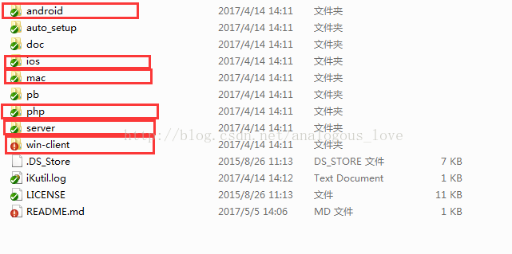

# TeamTalk源码分析（一）—— TeamTalk介绍

> 原文链接：https://blog.csdn.net/analogous_love/article/details/71196240

TeamTalk 是蘑菇街开源的一款企业内部用的即时通讯软件（Enterprise IM），类似腾讯的RTX。

项目地址github：https://github.com/baloonwj/TeamTalk

载项目解压后目录结构是这样的：

这款即时通讯软件分为服务器端（linux）、pc端、web端、mac端和两个移动端（ios和安卓），源码中使用了大量的开源技术（用项目作者的话说，就是“拿来主义”）。例如通信协议使用了google protobuf，服务器端使用了内存数据库redis，pc端界面库使用的duilib，pc端的日志系统使用的是YAOLOG库、cximage、jsoncpp库等等。在接下来各个端的源码分析中，我们将会深入和细致地介绍。

下一篇将介绍首先介绍服务器端的程序的编译与部署。