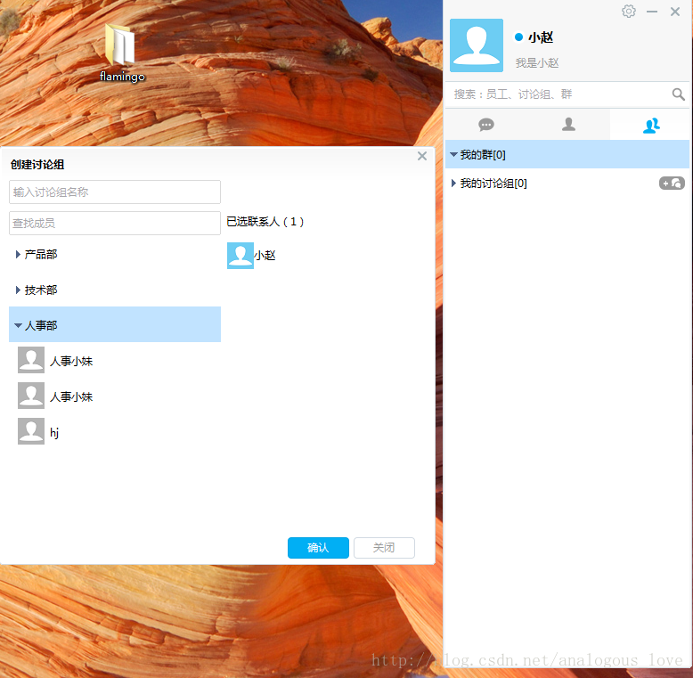
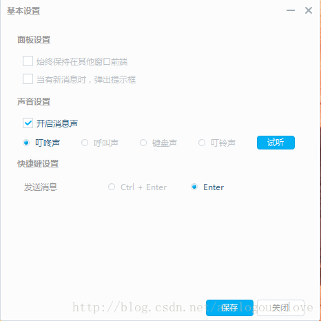
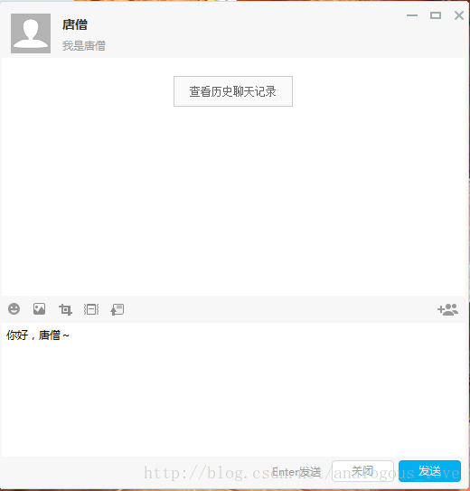
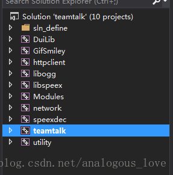
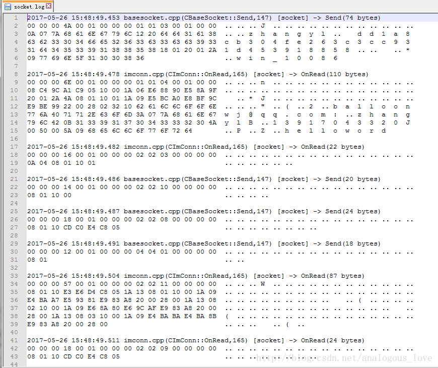

# TeamTalk源码分析（十） —— pc客户端源码分析

> 原文：TeamTalk源码分析（十一） —— pc客户端源码分析
>
> ​       在要不要写这篇文章的纠结中挣扎了好久，就我个人而已，我接触 windows 编程，已经六七个年头了，尤其是在我读研的三年内，基本心思都是花在学习和研究 windows 程序上了。我很庆幸我当初学习 windows 程序走了一条正确的路线：先是学习常用的 windows 程序原理和基本 API，再学习的 mfc、wtl等一些常用的框架和类库，同时看了大量 windows 项目的源码，如金山卫士的开源代码、filezilla、电驴源码等等。个人觉得，基础真的很重要，拿 windows 开发来说，当你掌握了 windows 的程序的基本原理，我列一下大致范围：
>
> 1. windows消息机制（消息如何产生、如何发送、如何处理，常见的消息有哪些、消息的优先级、如何自定义消息、窗体消息、常用控件消息）
>
> 2. gdi原理（要熟悉gdi的各种对象，如画笔、画刷、字体、区域、裁剪、位图等，熟悉它们的API，熟悉各种gdi绘图API、当然最好也要熟悉一整套的gdi+的类，gdi与gdi+的区别）
>
> 3. windows进程与线程的概念（进程的概念、如何创建、如何结束、跨进程如何通信；线程的创建与销毁、线程间的同步与资源保护，熟悉windows常用的线程同步对象：临界区、事件、互斥体、信号量等）
>
> 4. windows内存管理（清晰地掌握一个进程地址空间的内存分布、windows堆的创建与管理等）
>
> 5. dll技术（dll的生成、变量的导出、函数的导出、类的导出、如何查看dll导出哪些函数、隐式dll的加载、显示dll的加载、远程dll注入技术等）
>
> 6. PE文件（一个PE文件的结构、有哪些节、如何修改、分别映射到进程地址空间的什么位置等）
>
> 7. windows SEH（结构化异常处理）
>
> 8. windows socket编程
>
> 9. windows读写文件技术（像CreateFile、WriteFile、GetFileSize等这些API应该熟练掌握、内存映射技术）
>
>    
>
>    当然很多必备的技术也不好归类到 windows 技术下面，比如 socket 编程，这涉及到很多网络的知识，比如 tcp 的三次握手，数据的收发等，还有就是各种字符编码的知识、以及之间的相互转换，又比如一系列的 CRT 函数及其对应的宽字符版本。当然如果你搞 windows 开发，一定要熟悉开发工具 Visual Studio，熟悉其工程项目的大多数属性配置，而且要做到知其然也知其所以然。如果不是不能跨平台，我敢说 VS 是史上最好最强大的开发工具，没有之一！我已经有好几年年不做 windows 开发了，目前主要从事 linux 开发，但 windows 的很多设计思想真的很好，非常值得借鉴，而且从编码风格来说，虽然看起来有点怪异，但是非常规范和易懂。
>
>    
>
>     有了基础知识，你可以轻松地对工作中的一些问题给出解决方案，也能轻松阅读和使用市面上的那些库，比如，如果你深刻理解 windows GDI，你不会在一个群里大喊，duilib 某个属性为什么不起作用，你可以直接去阅读它的画法代码，如果是 bug 你可以改 bug，如果只是你使用错误，你可以了解到正确的使用方法。所以基础这个东西，在短时间内，可能让你看不出与其他人的差别，但是从长远来看，它决定着你在技术上走的高度与深度。套用侯捷先生的一句话：勿在浮沙筑高台。
>
>       
>
>     —— 正题
>
>    上面简单地介绍了下，我个人学习 windows 程序设计的一些心得吧。扯的有点远了，让我们回到正题上来，来分析 TeamTalk 的源码吧。当然这篇文章与前面介绍的不一样，我们不仅介绍程序的正题设计思路，还会介绍一些有意义的细节，比如一些 windows 开发中常用的一些细节。

## 一、程序功能    
我们来先看下 TeamTalk pc 客户端包括哪些功能：TeamTalk 因为开发的初衷是用于企业内部的即时通讯软件，所以，不提供对外注册的功能，一个员工的加入一般是人事部门在后台管理系统来新增该员工信息。其功能包括登录、聊天、群聊和建讨论组，当然聊天过程中可以发文字、表情、图片和文件，还包括查看聊天记录和简单地查看某个员工的个人信息，业务功能其实不多的。下面是一些功能截图：

 

## 二、编译方法与项目工程文件介绍

1. TeamTalk的pc客户端的下载地址是：https://github.com/baloonwj/TeamTalk

 代码包括服务器端代码、pc端、mac端、安卓和IOS端，还有web端所有代码。

 pc客户端代码的编译方法很简单：用VS2013打开win-client\solution目录下的teamtalk.sln，编译即可。你的VS版本至少要是VS2013，因为代码中大量使用了C++11的东西，VS2013以下版本是不支持C++11的语法的。当然，如果你是VS2015的话，可以参考这篇文章来进行修改和编译：http://www.07net01.com/linux/2017/01/1795569.html

 

打开 teamtalk.sln 之后，总共有10个解决方法，如下图所示：

 

其中 teamtalk 是主工程，你应该将它设置成启动工程，编译完成之后就可以调试了。你可以自己配置服务器来连接进行调试，我也可以连接我的测试服务器，具体参见《TeamTalk源码分析（十） —— 开放一个TeamTalk测试服务器地址和几个测试账号》。下面先大致介绍一个各个工程的作用：

1. Duilib 是 teamtalk 使用的一款开源界面库，该界面库模仿 web 开发中的布局技术，使用 xml 文件来布局 windows 界面，并且在主窗口上绘制所有子控件，也就是所谓的 directUI 技术；

2. GifSmiley 是程序中用来解析和显示 gif 格式的图片的库，以支持 gif 图片的动画效果；

3. httpclient 功能是程序中使用的 http 请求库，登录前程序会先连接服务器的 login_server 以获得后续需要登录的 msg_server 的 ip 地址和端口号 等信息，这里就是使用的 http 协议，同时聊天过程中收发的聊天图片与图片服务器 msfs 也使用 http 协议来收发这些图片；

4. libogg 是一个语音库，用来解析声音文件的，因为 pc 客户端可能会收到移动端的语音聊天，相比较传统的 *.wav、*.mp3、*.wma，*.ogg 格式的不仅音质高，而且音频文件的体积小，腾讯的 QQ 游戏英雄杀中的语音也是使用这个格式的。

5. libspeex 是一个音频压缩库；

6. Modules 就是 TeamTalk 中使用的各种库了，展开来看下你就明白了：

 

7. network 是 teamtalk 使用的网络通信的代码，其实 teamtalk pc 端和服务器端使用的是同一套网络通信库，只不过如果服务器运行在 linux下，其核心的IO复用模型是 epoll，而 pc 客户端使用的 IO 复用模型是 select；

8. speexdec 也是和 ogg 格式相关的编码和解码器；

9. teamtalk 是主程序入口工程；

10. utility 包含了 teamtalk 中用到的一些工具类工程，比如 sqlite 的包装接口、md5 工具类等。

 

除了上面介绍的一些库以外，程序还使用了 sqlite 库、谷歌 protobuf 库、日志库 yaolog 等。关于 yaolog 可参见 http://blog.csdn.net/gemo/article/details/8499692，这个日志库比较有意思的地方是可以单独打印出网络通信中的字节流的二进制形式，推荐一下，效果如下图所示（位于win-client\bin\teamtalk\Debug\log\socket.log文件中）：

## 三、程序总体框架介绍
整个程序使用了 mfc 框架来做一个架子，而所有的窗口和对话框都使用的是 duilib，关于 duilib 网上有很多资料，这里不介绍 duilib 细节的东西了。一个 mfc 程序框架，使用起来也很简单，就是定义一个类集成 mfc 的 CWinApp 类，并改写其 InitInstance() 方法，mfc 内部会替我们做好消息循环的步骤。TeamTalk 相关的代码如下：

	// 位于teamtalk.h 中
	class CteamtalkApp : public CWinApp
	{
	public:
		CteamtalkApp();
	
	public:
		virtual BOOL InitInstance();
		virtual BOOL ExitInstance();
	
	private:
		/**
		 *  创建用户目录
		 *
		 * @return  BOOL
		 * @exception there is no any exception to throw.
		 */	
		BOOL _CreateUsersFolder();
		/**
		 * 创建主窗口
		 *
		 * @return  BOOL
		 * @exception there is no any exception to throw.
		 */	
		BOOL _CreateMainDialog();
		/**
		* 销毁主窗口
		*
		* @return  BOOL
		* @exception there is no any exception to throw.
		*/
		BOOL _DestroyMainDialog();
		/**
		* 判断是否是单实例
		*
		* @return  BOOL
		* @exception there is no any exception to throw.
		*/
		BOOL _IsHaveInstance();
	  void _InitLog();
	private:
		MainDialog*						m_pMainDialog;
	};

在 teamtalk.cpp 中定义了唯一的全局对象 CteamtalkApp 对象：

接着，所有的初始化工作就是写在CteamtalkApp::InitInstance()方法中了：

 

BOOL CteamtalkApp::InitInstance()
{
	INITCOMMONCONTROLSEX InitCtrls;
	InitCtrls.dwSize = sizeof(InitCtrls);
	InitCtrls.dwICC = ICC_WIN95_CLASSES;
	InitCommonControlsEx(&InitCtrls);

	//log init
	_InitLog();
	 
	// Verify that the version of the library that we linked against is
	// compatible with the version of the headers we compiled against.
	GOOGLE_PROTOBUF_VERIFY_VERSION;
	 
	LOG__(APP, _T("===================================VersionNO:%d======BulidTime：%s--%s==========================")
		, TEAMTALK_VERSION, util::utf8ToCString(__DATE__), util::utf8ToCString(__TIME__));
	if (!__super::InitInstance())
	{
		LOG__(ERR, _T("__super::InitInstance failed."));
		return FALSE;
	}
	AfxEnableControlContainer();
	 
	//为了调试方便，暂且注释掉
	//if (_IsHaveInstance())
	//{
	//	LOG__(ERR, _T("Had one instance,this will exit"));
	//	HWND hwndMain = FindWindow(_T("TeamTalkMainDialog"), NULL);
	//	if (hwndMain)
	//	{
	//		::SendMessage(hwndMain, WM_START_MOGUTALKINSTANCE, NULL, NULL);
	//	}
	//	return FALSE;
	//}
	 
	//start imcore lib
	//在这里启动任务队列和网络IO线程
	if (!imcore::IMLibCoreRunEvent())
	{
		LOG__(ERR, _T("start imcore lib failed!"));
	}
	LOG__(APP, _T("start imcore lib done"));
	 
	//start ui event
	//在这里创建代理窗口并启动定时器定时处理任务
	if (module::getEventManager()->startup() != imcore::IMCORE_OK)
	{
		LOG__(ERR, _T("start ui event failed"));
	}
	LOG__(APP, _T("start ui event done"));
	 
	//create user folders
	_CreateUsersFolder();
	
	//duilib初始化
	CPaintManagerUI::SetInstance(AfxGetInstanceHandle());
	CPaintManagerUI::SetResourcePath(CPaintManagerUI::GetInstancePath() + _T("..\\gui\\"));//track这个设置了路径，会导致base里设置的无效。
	::CoInitialize(NULL);
	::OleInitialize(NULL);
	 
	//无需配置server
	module::TTConfig* pCfg = module::getSysConfigModule()->getSystemConfig();
	if (pCfg && pCfg->loginServIP.IsEmpty())
	{
		if (!module::getSysConfigModule()->showServerConfigDialog(NULL))
		{
			LOG__(APP, _T("server config canceled"));
			return FALSE;
		}
	}
	 
	if (!module::getLoginModule()->showLoginDialog())
	{
		LOG__(ERR, _T("login canceled"));
		return FALSE;
	}
	LOG__(APP,_T("login success"));
	 
	//创建主窗口
	if (!_CreateMainDialog())
	{
		LOG__(ERR, _T("Create MianDialog failed"));
		return FALSE;
	}
	LOG__(APP, _T("Create MianDialog done"));
	 
	CPaintManagerUI::MessageLoop();
	CPaintManagerUI::Term();
	 
	return TRUE;
}

上述代码大致做了以下工作：

 

 

// 1. 初始化yaolog日志库

// 2. google protobuf的版本号检测

// 3. 启动网络通信线程检测网络数据读写，再启动一个线程创建一个队列，如果队列中有任务，则取出该任务执行

// 4. 创建支线程与UI线程的桥梁——代理窗口

// 5. 创建用户文件夹

// 6. 配置duilib的资源文件路径、初始化com库、初始化ole库 

// 7. 如果没有配置登录服务器的地址，则显示配置对话框

// 8. 显示登录对话框

// 9. 登录成功后，登录对话框销毁，显示主对话框

// 10. 启动duilib的消息循环（也就是说不使用mfc的消息循环）

其它的没什么好介绍的，我们来重点介绍下第3点和第4点。先说第3点，在第3点中又会牵扯出第4点，网络通信线程的启动：

 

 

//start imcore lib
//在这里启动任务队列和网络IO线程
if (!imcore::IMLibCoreRunEvent())
{
	LOG__(ERR, _T("start imcore lib failed!"));
}
LOG__(APP, _T("start imcore lib done"));
	LOG__(ERR, _T("start imcore lib failed!"));
}
LOG__(APP, _T("start imcore lib done"));

bool IMLibCoreRunEvent()
{	
	LOG__(NET, _T("==============================================================================="));

	//在这里启动任务队列处理线程
	getOperationManager()->startup();
	 
	CAutoLock lock(&g_lock);
	if (!netlib_is_running())
	{
#ifdef _MSC_VER
		unsigned int m_dwThreadID;
		//在这里启动网络IO线程
		g_hThreadHandle = (HANDLE)_beginthreadex(0, 0, event_run, 0, 0, (unsigned*)&m_dwThreadID);
		if (g_hThreadHandle < (HANDLE)2)
		{
			m_dwThreadID = 0;
			g_hThreadHandle = 0;
		}
		return g_hThreadHandle >(HANDLE)1;
#else
		pthread_t pt;
		pthread_create(&pt, NULL, event_run, NULL);
#endif
	}

	return true;
}

先看getOperationManager()->startup();：

 

 

IMCoreErrorCode OperationManager::startup()
{
	m_operationThread = std::thread([&]
	{
		std::unique_lock <std::mutex> lck(m_cvMutex);
		Operation* pOperation = nullptr;
		while (m_bContinue)
		{
			if (!m_bContinue)
				break;
			if (m_vecRealtimeOperations.empty())
				m_CV.wait(lck);
			if (!m_bContinue)
				break;
			{
				std::lock_guard<std::mutex> lock(m_mutexOperation);
				if (m_vecRealtimeOperations.empty())
					continue;
				pOperation = m_vecRealtimeOperations.front();
				m_vecRealtimeOperations.pop_front();
			}

			if (!m_bContinue)
				break;
	 
			if (pOperation)
			{
				pOperation->process();
				pOperation->release();
			}
		}
	});
	 
	return IMCORE_OK;
}

这里利用一个C++11的新语法lamda表达式来创建一个线程，线程函数就是lamda表达式的具体内容：先从队列中取出任务，然后执行。所有的任务都继承其基类Operation，而Operation又继承接口类IOperatio，任务类根据自己具体需要做什么来改写process()方法：

 

class NETWORK_DLL Operation : public IOperation
{
	enum OperationState
	{
		OPERATION_IDLE = 0,
		OPERATION_STARTING,
		OPERATION_RUNNING,
		OPERATION_CANCELLING,
		OPERATION_FINISHED
	};

public:
    /** @name Constructors and Destructor*/

    //@{
    /**
     * Constructor 
     */
    Operation();
    Operation(const std::string& name);
    /**
     * Destructor
     */
    virtual ~Operation();
    //@}

public:
	virtual void processOpertion() = 0;

public:
	virtual void process();
	virtual void release();

    inline std::string name() const { return m_name; }
    inline void set_name(__in std::string name){ m_name = name; }

private:
	OperationState			m_state;
    std::string				m_name;
};

struct NETWORK_DLL IOperation
{
public:
	virtual void process() = 0;
//private:
	/**
	* 必须让容器来释放自己
	*
	* @return  void
	* @exception there is no any exception to throw.
	*/
	virtual void release() = 0;
};

这里我们介绍的任务队列我们称为队列A，下文中还有一个专门做http请求的队列，我们称为队列B。

 

后半部分代码其实就是启动网络检测线程，检测网络数据读写：

 

g_hThreadHandle = (HANDLE)_beginthreadex(0, 0, event_run, 0, 0, (unsigned*)&m_dwThreadID);

unsigned int __stdcall event_run(void* threadArgu)
{
	LOG__(NET,  _T("event_run"));
	netlib_init();
	netlib_set_running();
	netlib_eventloop();
	return NULL;
}

void netlib_eventloop(uint32_t wait_timeout)
{
	CEventDispatch::Instance()->StartDispatch(wait_timeout);
}

void CEventDispatch::StartDispatch(uint32_t wait_timeout)
{
	fd_set read_set, write_set, excep_set;
	timeval timeout;
	timeout.tv_sec = 1;	//wait_timeout 1 second
	timeout.tv_usec = 0;

    while (running)
    {
    	//_CheckTimer();
    	//_CheckLoop();
     
    	if (!m_read_set.fd_count && !m_write_set.fd_count && !m_excep_set.fd_count)
    	{
    		Sleep(MIN_TIMER_DURATION);
    		continue;
    	}
     
    	m_lock.lock();
    	FD_ZERO(&read_set);
    	FD_ZERO(&write_set);
    	FD_ZERO(&excep_set);
    	memcpy(&read_set, &m_read_set, sizeof(fd_set));
    	memcpy(&write_set, &m_write_set, sizeof(fd_set));
    	memcpy(&excep_set, &m_excep_set, sizeof(fd_set));
    	m_lock.unlock();
     
    	if (!running)
    		break;
     
    	//for (int i = 0; i < read_set.fd_count; i++) {
    	//	LOG__(NET,  "read fd: %d\n", read_set.fd_array[i]);
    	//}
    	int nfds = select(0, &read_set, &write_set, &excep_set, &timeout);
    	if (nfds == SOCKET_ERROR)
    	{
    		//LOG__(NET,  "select failed, error code: %d\n", GetLastError());
    		Sleep(MIN_TIMER_DURATION);
    		continue;			// select again
    	}
    	if (nfds == 0)
    	{
    		continue;
    	}
    	for (u_int i = 0; i < read_set.fd_count; i++)
    	{
    		//LOG__(NET,  "select return read count=%d\n", read_set.fd_count);
    		SOCKET fd = read_set.fd_array[i];
    		CBaseSocket* pSocket = FindBaseSocket((net_handle_t)fd);
    		if (pSocket)
    		{
    			pSocket->OnRead();
    			pSocket->ReleaseRef();
    		}
    	}
    	for (u_int i = 0; i < write_set.fd_count; i++)
    	{
    		//LOG__(NET,  "select return write count=%d\n", write_set.fd_count);
    		SOCKET fd = write_set.fd_array[i];
    		CBaseSocket* pSocket = FindBaseSocket((net_handle_t)fd);
    		if (pSocket)
    		{
    			pSocket->OnWrite();
    			pSocket->ReleaseRef();
    		}
    	}
    	for (u_int i = 0; i < excep_set.fd_count; i++)
    	{
    		LOG__(NET,  _T("select return exception count=%d"), excep_set.fd_count);
    		SOCKET fd = excep_set.fd_array[i];
    		CBaseSocket* pSocket = FindBaseSocket((net_handle_t)fd);
    		if (pSocket)
    		{
    			pSocket->OnClose();
    			pSocket->ReleaseRef();
    		}
    	}
    }
}

我们举个具体的例子来说明这个三个线程的逻辑（任务队列A、网络线程和下文要介绍的专门处理http请求的任务队列B）和代理窗口的消息队列，以在登录对话框输入用户名和密码后接下来的步骤：

 

//位于LoginDialog.cpp中
void LoginDialog::_DoLogin()
{
	LOG__(APP,_T("User Clicked LoginBtn"));

	m_ptxtTip->SetText(_T(""));
	CDuiString userName = m_pedtUserName->GetText();
	CDuiString password = m_pedtPassword->GetText();
	if (userName.IsEmpty())
	{
		CString csTip = util::getMultilingual()->getStringById(_T("STRID_LOGINDIALOG_USERNAME_EMPTY"));
		m_ptxtTip->SetText(csTip);
		return;
	}
	if (password.IsEmpty())
	{
		CString csTip = util::getMultilingual()->getStringById(_T("STRID_LOGINDIALOG_PASSWORD_EMPTY"));
		m_ptxtTip->SetText(csTip);
		return;
	}
	module::TTConfig* pCfg = module::getSysConfigModule()->getSystemConfig();
	pCfg->userName = userName;
	if (m_bPassChanged)
	{
		std::string sPass = util::cStringToString(CString(password));
		char* pOutData = 0;
		uint32_t nOutLen = 0;
		int retCode = EncryptPass(sPass.c_str(), sPass.length(), &pOutData, nOutLen);
		if (retCode == 0 && nOutLen > 0 && pOutData != 0)
		{
			pCfg->password = std::string(pOutData, nOutLen);
			Free(pOutData);
		}
		else
		{
			LOG__(ERR, _T("EncryptPass Failed!"));
			CString csTip = util::getMultilingual()->getStringById(_T("STRID_LOGINDIALOG_LOGIN_ENCRYPT_PASE_FAIL"));
			m_ptxtTip->SetText(csTip);			
			return;
		}
	}
	 
	pCfg->isRememberPWD = m_pChkRememberPWD->GetCheck();
	module::getSysConfigModule()->saveData();
	 
	CString csTxt = util::getMultilingual()->getStringById(_T("STRID_LOGINDIALOG_BTN_DOLOGIN"));
	m_pBtnLogin->SetText(csTxt);
	m_pBtnLogin->SetEnabled(false);
	 
	//连接登陆服务器
	DoLoginServerParam param;
	DoLoginServerHttpOperation* pOper = new DoLoginServerHttpOperation(
		BIND_CALLBACK_1(LoginDialog::OnHttpCallbackOperation), param);
	module::getHttpPoolModule()->pushHttpOperation(pOper);
}

点击登录按钮之后，程序先对用户名和密码进行一些有效性校验，接着产生一个DoLoginServerHttpOperation对象，该类继承IHttpOperation，IHttpOperation再继承ICallbackOpertaion，ICallbackOpertaion再继承Operation类。这个任务会绑定一个任务完成之后的回调函数，即宏BIND_CALLBACK_1，这个宏实际上就是std::bind：

 

 

#define BIND_CALLBACK_1(func)   std::bind(&func, this, placeholders::_1)
#define BIND_CALLBACK_2(func)	std::bind(&func, this, placeholders::_1, placeholders::_2)

往任务队列中放入任务的动作如下：

 

 

void HttpPoolModule_Impl::pushHttpOperation(module::IHttpOperation* pOperaion, BOOL bHighPriority /*= FALSE*/)
{
	if (NULL == pOperaion)
	{
		return;
	}

	CAutoLock lock(&m_mtxLock);
	if (bHighPriority)
		m_lstHttpOpers.push_front(pOperaion);
	else
		m_lstHttpOpers.push_back(pOperaion);
	_launchThread();
	::ReleaseSemaphore(m_hSemaphore, 1, NULL);
	 
	return;
}

其中_launchThread()会启动一个线程，该线程函数是另外一个任务队列，专门处理http任务：

 

 

BOOL HttpPoolModule_Impl::_launchThread()
{
	if ((int)m_vecHttpThread.size() >= MAX_THEAD_COUNT)
	{
		return TRUE;
	}

	TTHttpThread* pThread = new TTHttpThread();
	PTR_FALSE(pThread);
	if (!pThread->create())
	{
		return FALSE;
	}
	Sleep(300);
	 
	m_vecHttpThread.push_back(pThread);
	 
	return TRUE;
}

线程函数最终实际执行代码如下：

 

 

UInt32 TTHttpThread::process()
{
	module::IHttpOperation * pHttpOper = NULL;
	HttpPoolModule_Impl *pPool = m_pInstance;
	while (m_bContinue)
	{
		if (WAIT_OBJECT_0 != ::WaitForSingleObject(pPool->m_hSemaphore, INFINITE))
		{
			break;
		}

		if (!m_bContinue)
		{
			break;
		}
	 
		{
			CAutoLock lock(&(pPool->m_mtxLock));
			if (pPool->m_lstHttpOpers.empty())
				pHttpOper = NULL;
			else
			{
				pHttpOper = pPool->m_lstHttpOpers.front();
				pPool->m_lstHttpOpers.pop_front();
			}
		}
	 
		try
		{
			if (m_bContinue && pHttpOper)
			{
				pHttpOper->process();
				pHttpOper->release();
			}
		}
		catch (...)
		{
			LOG__(ERR, _T("TTHttpThread: Failed to execute opertaion(0x%p)"), pHttpOper);
		}
	}
	 
	return 0;
}

当这个http任务被任务队列执行时，实际执行DoLoginServerHttpOperation::processOpertion()，代码如下：

 

 

void DoLoginServerHttpOperation::processOpertion()
{
	module::TTConfig* pCfg = module::getSysConfigModule()->getSystemConfig();
	LOG__(APP, _T("loginAddr = %s"), pCfg->loginServIP);
	std::string& loginAddr = util::cStringToString(pCfg->loginServIP);
	std::string url = loginAddr;
	
	DoLoginServerParam* pPamram = new DoLoginServerParam();
	pPamram->resMsg = util::getMultilingual()->getStringById(_T("STRID_LOGINDIALOG_LOGIN_HTTP_DEFERROR"));
	Http::HttpResponse	response;
	Http::HttpClient	client;
	//对于登录：url=http://192.168.226.128:8080/msg_server
	Http::HttpRequest	request("get", url);
	if (!client.execute(&request, &response))
	{
		CString csTemp = util::stringToCString(url);
		pPamram->result = DOLOGIN_FAIL;
		LOG__(ERR,_T("failed %s"), csTemp);
		asyncCallback(std::shared_ptr<void>(pPamram));
		client.killSelf();
		return;
	}
	/**
	    {
	       "backupIP" : "localhost",
	       "code" : 0,
	       "discovery" : "http://127.0.0.1/api/discovery",
	       "msfsBackup" : "http://127.0.0.1:8700/",
	       "msfsPrior" : "http://127.0.0.1:8700/",
	       "msg" : "",
	       "port" : "8000",
	       "priorIP" : "localhost"
	    }
	 */
	std::string body = response.getBody();
	client.killSelf();
	//json解析
	try
	{
		Json::Reader reader;
		Json::Value root;
		if (!reader.parse(body, root))
		{
			CString csTemp = util::stringToCString(body);
			LOG__(ERR, _T("parse data failed,%s"), csTemp);
			pPamram->result = DOLOGIN_FAIL;
			pPamram->resMsg = util::getMultilingual()->getStringById(_T("STRID_LOGINDIALOG_LOGIN_HTTP_JSONERROR"));
			goto End;
		}
		int nCode = root.get("code", "").asInt();
		if (0 == nCode)//登陆成功
		{
			LOG__(APP, _T("get msgSvr IP succeed!"));
			pCfg->msgSevPriorIP = root.get("priorIP", "").asString();
			pCfg->msgSevBackupIP = root.get("backupIP", "").asString();
			std::string strPort = root.get("port", "").asString();
			pCfg->msgServPort = util::stringToInt32(strPort);
	 
			pCfg->fileSysAddr = util::stringToCString(root.get("msfsPrior", "").asString());
			pCfg->fileSysBackUpAddr = util::stringToCString(root.get("msfsBackup", "").asString());
			pPamram->result = DOLOGIN_SUCC;
		}
		else
		{
			LOG__(ERR, _T("get msgSvr IP failed! Code = %d"),nCode);
			pPamram->result = DOLOGIN_FAIL;
			CString csRetMsgTemp = util::stringToCString(root.get("msg", "").asString());
			if (!csRetMsgTemp.IsEmpty())
				pPamram->resMsg = csRetMsgTemp;
		}
	}
	catch (...)
	{
		CString csTemp = util::stringToCString(body);
		LOG__(ERR,_T("parse json execption,%s"), csTemp);
		pPamram->result = DOLOGIN_FAIL;
		pPamram->resMsg = util::getMultilingual()->getStringById(_T("STRID_LOGINDIALOG_LOGIN_HTTP_JSONERROR"));
	}

End:
	asyncCallback(std::shared_ptr<void>(pPamram));
}

实际上是向login_server发送一个http请求，这是一个同步请求。得到的结果是一个json字符串，代码注释中已经给出。然后调用asyncCallback(std::shared_ptr<void>(pPamram));参数pPamram携带了当前任务的回调函数指针：

 

 

/**
* 异步回调，借助UIEvent
*
* @param   std::shared_ptr<void> param
* @return  void
* @exception there is no any exception to throw.
*/

void asyncCallback(std::shared_ptr<void> param)
{
	CallbackOperationEvent* pEvent = new CallbackOperationEvent(m_callback, param);
	module::getEventManager()->asynFireUIEvent(pEvent);
}

这实际上产生了一个回调事件。也就是说队列B做http请求，操作完成后往代理窗口的消息队列中放入一个回调事件，这个事件通过代理窗口过程函数来处理的（这就是上文中第4点介绍的代理窗口过程的作用，实际上是利用windows消息队列来做任务处理（系统有现成的任务队列系统，为何不利用呢？））：

 

 

module::IMCoreErrorCode UIEventManager::asynFireUIEvent(IN const IEvent* const pEvent)
{
	assert(m_hWnd);
	assert(pEvent);
	if (0 == m_hWnd || 0 == pEvent)
		return IMCORE_ARGUMENT_ERROR;

	if (FALSE == ::PostMessage(m_hWnd, UI_EVENT_MSG, reinterpret_cast<WPARAM>(this), reinterpret_cast<WPARAM>(pEvent)))
		return IMCORE_WORK_POSTMESSAGE_ERROR;
	 
	return IMCORE_OK;
}

看到没有？向代理窗口的消息队列中投递一个UI_EVENT_MSG事件，并在消息参数LPARAM中传递了回调事件的对象指针。这样代理窗口过程函数就可以处理这个消息了：

 

 

LRESULT _stdcall UIEventManager::_WindowProc(HWND hWnd
											, UINT message
											, WPARAM wparam
											, LPARAM lparam)
{
	switch (message)
	{
	case UI_EVENT_MSG:
		reinterpret_cast<UIEventManager*>(wparam)->_processEvent(reinterpret_cast<IEvent*>(lparam), TRUE);
		break;
	case WM_TIMER:
		reinterpret_cast<UIEventManager*>(wparam)->_processTimer();
		break;
	default:
		break;
	}
	return ::DefWindowProc(hWnd, message, wparam, lparam);
}

void UIEventManager::_processEvent(IEvent* pEvent, BOOL bRelease)
{
	assert(pEvent);
	if (0 == pEvent)
		return;

	try
	{
		pEvent->process();
		if (bRelease)
			pEvent->release();
	}
	catch (imcore::Exception *e)
	{
		LOG__(ERR, _T("event run exception"));
		pEvent->onException(e);
		if (bRelease)
			pEvent->release();
		if (e)
		{
			LOG__(ERR, _T("event run exception:%s"), util::stringToCString(e->m_msg));
			assert(FALSE);
		}
	}
	catch (...)
	{
		LOG__(ERR, _T("operation run exception,unknown reason"));
		if (bRelease)
			pEvent->release();
		assert(FALSE);
	}
}

根据C++的多态特性，pEvent->process()实际上调用的是CallbackOperationEvent.process()。代码如下：

 

	virtual void process()
	{
		m_callback(m_param);
	}

m_callback(m_param);调用的就是上文中介绍DoLoginServerHttpOperation操作的回调函数LoginDialog::OnHttpCallbackOperation()：

 

 

void LoginDialog::OnHttpCallbackOperation(std::shared_ptr<void> param)
{
	DoLoginServerParam* pParam = (DoLoginServerParam*)param.get();
	if (DOLOGIN_SUCC == pParam->result)
	{
		module::TTConfig* pCfg = module::getSysConfigModule()->getSystemConfig();
		PTR_VOID(pCfg);
		LoginParam loginparam;
		loginparam.csUserName = pCfg->userName;
		loginparam.password = pCfg->password;
		loginparam.csUserName.Trim();
		LoginOperation* pOperation = new LoginOperation(
			BIND_CALLBACK_1(LoginDialog::OnOperationCallback), loginparam);
		imcore::IMLibCoreStartOperation(pOperation);
	}
	else
	{
		m_ptxtTip->SetText(pParam->resMsg);
		module::TTConfig* pCfg = module::getSysConfigModule()->getSystemConfig();
		LOG__(ERR, _T("get MsgServer config faild,login server addres:%s:%d"), pCfg->loginServIP,pCfg->loginServPort);

		CString csTxt = util::getMultilingual()->getStringById(_T("STRID_LOGINDIALOG_BTN_LOGIN"));
		m_pBtnLogin->SetText(csTxt);
		m_pBtnLogin->SetEnabled(true);
	}
}

ok，终于到家了。但是这并没结束，我们只介绍了队列B和代理窗口消息队列，还有队列A呢？LoginDialog::OnHttpCallbackOperation()会根据获取的msg_server的情况来再次产生一个新的任务LoginOperation来放入队列A中，这次才是真正的用户登录，根据上面的介绍，LoginOperation任务从队列A中取出来之后，实际执行的是LoginOperation::processOpertion()：

 

void LoginOperation::processOpertion()
{
	LOG__(APP,_T("login start,uname:%s,status:%d"), m_loginParam.csUserName
		, m_loginParam.mySelectedStatus);

	LoginParam* pParam = new LoginParam;
	pParam->csUserName = m_loginParam.csUserName;
	pParam->mySelectedStatus = m_loginParam.mySelectedStatus;
	 
	//连接消息服务器
	module::TTConfig* pCfg = module::getSysConfigModule()->getSystemConfig();
	CString server = util::stringToCString(pCfg->msgSevPriorIP);
	LOG__(APP, _T("MsgServeIp:%s,Port:%d"), server, pCfg->msgServPort);
	//8000端口
	IM::Login::IMLoginRes* pImLoginResp = (IM::Login::IMLoginRes*)module::getTcpClientModule()
		->doLogin(server, pCfg->msgServPort,m_loginParam.csUserName,m_loginParam.password);
	if (0 == pImLoginResp || pImLoginResp->result_code() != IM::BaseDefine::REFUSE_REASON_NONE 
		|| !pImLoginResp->has_user_info())
	{
		//TODO,若失败，尝试备用IP
		LOG__(ERR,_T("add:%s:%d,uname:%s,login for msg server failed"),server,pCfg->msgServPort, m_loginParam.csUserName);
		if (pImLoginResp)
		{
			CString errInfo = util::stringToCString(pImLoginResp->result_string());
			pParam->errInfo = errInfo;
			pParam->result = LOGIN_FAIL;
			pParam->server_result = pImLoginResp->result_code();
			LOG__(ERR, _T("error code :%d,error info:%s"), pImLoginResp->result_code(), errInfo);
		}
		else
		{
			pParam->result = IM::BaseDefine::REFUSE_REASON_NO_MSG_SERVER;
			LOG__(ERR, _T("login msg server faild！"));
		}
		asyncCallback(std::shared_ptr<void>(pParam));
		return;
	}
	pParam->result = LOGIN_OK;
	pParam->serverTime = pImLoginResp->server_time();
	pParam->mySelectedStatus = pImLoginResp->online_status();
	 
	//存储服务器端返回的userId
	IM::BaseDefine::UserInfo userInfo = pImLoginResp->user_info();
	pCfg->userId = util::uint32ToString(userInfo.user_id());
	pCfg->csUserId = util::stringToCString(pCfg->userId);
	 
	//登陆成功，创建自己的信息
	module::UserInfoEntity myInfo;
	myInfo.sId = pCfg->userId;
	myInfo.csName = m_loginParam.csUserName;
	myInfo.onlineState = IM::BaseDefine::USER_STATUS_ONLINE;
	myInfo.csNickName = util::stringToCString(userInfo.user_nick_name());
	myInfo.avatarUrl = userInfo.avatar_url();
	myInfo.dId = util::uint32ToString(userInfo.department_id());
	myInfo.department = myInfo.dId;
	myInfo.email = userInfo.email();
	myInfo.gender = userInfo.user_gender();
	myInfo.user_domain = userInfo.user_domain();
	myInfo.telephone = userInfo.user_tel();
	myInfo.status = userInfo.status();
	myInfo.signature = userInfo.sign_info();
	 
	module::getUserListModule()->createUserInfo(myInfo);
	 
	asyncCallback(std::shared_ptr<void>(pParam));
	 
	LOG__(APP, _T("login succeed! Name = %s Nickname = %s sId = %s status = %d")
		, m_loginParam.csUserName
		, util::stringToCString(userInfo.user_nick_name())
		, module::getSysConfigModule()->UserID()
		, m_loginParam.mySelectedStatus);
	 
	//开始发送心跳包
	module::getTcpClientModule()->startHeartbeat();
}

同理，数据包发生成功以后，会再往代理窗口的消息队列中产生一个回调事件，最终调用刚才说的LoginOperation绑定的回调函数：

 

 

void asyncCallback(std::shared_ptr<void> param)
{
	CallbackOperationEvent* pEvent = new CallbackOperationEvent(m_callback, param);
	module::getEventManager()->asynFireUIEvent(pEvent);
}

void LoginDialog::OnOperationCallback(std::shared_ptr<void> param)
{
	LoginParam* pLoginParam = (LoginParam*)param.get();

    if (LOGIN_OK == pLoginParam->result)	//登陆成功
    {
    	Close(IDOK);
     
    	//创建用户目录
    	_CreateUsersFolder();
     
    	//开启同步消息时间timer
    	module::getSessionModule()->startSyncTimeTimer();
    	module::getSessionModule()->setTime(pLoginParam->serverTime);
     
    	//通知服务器客户端初始化完毕,获取组织架构信息和群列表
    	module::getLoginModule()->notifyLoginDone();
    }
    else	//登陆失败处理
    {
    	module::getTcpClientModule()->shutdown();
    	if (IM::BaseDefine::REFUSE_REASON_NO_MSG_SERVER == pLoginParam->server_result)
    	{
    		CString csTip = util::getMultilingual()->getStringById(_T("STRID_LOGINDIALOG_LOGIN_MSGSVR_FAIL"));
    		m_ptxtTip->SetText(csTip);
    	}
    	else if (!pLoginParam->errInfo.IsEmpty())
    	{
    		m_ptxtTip->SetText(pLoginParam->errInfo);
    	}
    	else
    	{
    		CString errorCode = util::int32ToCString(pLoginParam->server_result);
    		CString csTip = util::getMultilingual()->getStringById(_T("STRID_LOGINDIALOG_LOGIN_UNKNOWN_ERROR"));
    		m_ptxtTip->SetText(csTip + CString(":") + errorCode);
    	}
    }
     
    CString csTxt = util::getMultilingual()->getStringById(_T("STRID_LOGINDIALOG_BTN_LOGIN"));
    m_pBtnLogin->SetText(csTxt);
    m_pBtnLogin->SetEnabled(true);
}

至此，登录才成功。等等，那数据包是怎么发到服务器的呢？这也是一个重点，我们来详细地介绍一下，LoginOperation::processOpertion()中有这一行代码：

 

doLogin函数代码如下：

 

IM::Login::IMLoginRes* TcpClientModule_Impl::doLogin(CString &linkaddr, UInt16 port
	,CString& uName,std::string& pass)
{
	m_socketHandle = imcore::IMLibCoreConnect(util::cStringToString(linkaddr), port);
	imcore::IMLibCoreRegisterCallback(m_socketHandle, this);
	if(util::waitSingleObject(m_eventConnected, 5000))
	{
		IM::Login::IMLoginReq imLoginReq;
		string& name = util::cStringToString(uName);
		imLoginReq.set_user_name(name);
		imLoginReq.set_password(pass);
		imLoginReq.set_online_status(IM::BaseDefine::USER_STATUS_ONLINE);
		imLoginReq.set_client_type(IM::BaseDefine::CLIENT_TYPE_WINDOWS);
		imLoginReq.set_client_version("win_10086");

		if (TCPCLIENT_STATE_OK != m_tcpClientState)
			return 0;
	 
		sendPacket(IM::BaseDefine::SID_LOGIN, IM::BaseDefine::CID_LOGIN_REQ_USERLOGIN, ++g_seqNum
			, &imLoginReq);
		m_pImLoginResp->Clear();
		util::waitSingleObject(m_eventReceived, 10000);
	}
	 
	return m_pImLoginResp;
}

这段代码先连接服务器，然后调用sendPacket()发送登录数据包。如何连接服务器使用了一些“奇技淫巧”，我们后面单独介绍。我们这里先来看sendPacket()发包代码：

 

 

 

void TcpClientModule_Impl::sendPacket(UInt16 moduleId, UInt16 cmdId, UInt16 seq, google::protobuf::MessageLite* pbBody)
{
	m_TTPBHeader.clear();
	m_TTPBHeader.setModuleId(moduleId);
	m_TTPBHeader.setCommandId(cmdId);
	m_TTPBHeader.setSeqNumber(seq);

	_sendPacket(pbBody);
}

void TcpClientModule_Impl::_sendPacket(google::protobuf::MessageLite* pbBody)
{
	UInt32 length = imcore::HEADER_LENGTH + pbBody->ByteSize();
	m_TTPBHeader.setLength(length);
	std::unique_ptr<byte> data(new byte[length]);
	memset(data.get(), 0, length);
	memcpy(data.get(), m_TTPBHeader.getSerializeBuffer(), imcore::HEADER_LENGTH);
	if (!pbBody->SerializeToArray(data.get() + imcore::HEADER_LENGTH, pbBody->ByteSize()))
	{
		LOG__(ERR, _T("pbBody SerializeToArray failed"));
		return;
	}
	imcore::IMLibCoreWrite(m_socketHandle, data.get(), length);
}

其实就是序列化成protobuf要求的格式，然后调用imcore::IMLibCoreWrite(m_socketHandle, data.get(), length);发出去：

 

 

int IMLibCoreWrite(int key, uchar_t* data, uint32_t size)
{
	int nRet = -1;
	int nHandle = key;
	CImConn* pConn = TcpSocketsManager::getInstance()->get_client_conn(nHandle);
	if (pConn) {
		pConn->Send((void*)data, size);
	}
	else {
		LOG__(NET,  _T("connection is invalied:%d"), key);
	}

	return nRet;
}

先尝试着直接发送，如果目前tcp窗口太小发不出去，则暂且将数据放在发送缓冲区里面，并检测socket可写事件。这里就是和服务器一样的网络库的代码了，前面一系列的文章，我们已经介绍过了。

int CImConn::Send(void* data, int len)
{
	if (m_busy)
	{
		m_out_buf.Write(data, len);
		return len;
	}

	int offset = 0;
	int remain = len;
	while (remain > 0) {
		int send_size = remain;
		if (send_size > NETLIB_MAX_SOCKET_BUF_SIZE) {
			send_size = NETLIB_MAX_SOCKET_BUF_SIZE;
		}
	 
		int ret = netlib_send(m_handle, (char*)data + offset, send_size);
		if (ret <= 0) {
			ret = 0;
			break;
		}
	 
		offset += ret;
		remain -= ret;
	}
	 
	if (remain > 0)
	{
		m_out_buf.Write((char*)data + offset, remain);
		m_busy = true;
		LOG__(NET,  _T("send busy, remain=%d"), m_out_buf.GetWriteOffset());
	}
	 
	return len;
}

数据发出去以后，服务器应答登录包，网络线程会检测到socket可读事件：

 

 

void CBaseSocket::OnRead()
{
	if (m_state == SOCKET_STATE_LISTENING)
	{
		_AcceptNewSocket();
	}
	else
	{
		u_long avail = 0;
		if ( (ioctlsocket(m_socket, FIONREAD, &avail) == SOCKET_ERROR) || (avail == 0) )
		{
			m_callback(m_callback_data, NETLIB_MSG_CLOSE, (net_handle_t)m_socket, NULL);
		}
		else
		{
			m_callback(m_callback_data, NETLIB_MSG_READ, (net_handle_t)m_socket, NULL);
		}
	}
}

void imconn_callback(void* callback_data, uint8_t msg, uint32_t handle, void* pParam)
{
	NOTUSED_ARG(handle);
	NOTUSED_ARG(pParam);

	CImConn* pConn = TcpSocketsManager::getInstance()->get_client_conn(handle);
	if (!pConn)
	{
		//LOG__(NET, _T("connection is invalied:%d"), handle);
		return;
	}
	pConn->AddRef();
	 
	//	LOG__(NET,  "msg=%d, handle=%d\n", msg, handle);
	 
	switch (msg)
	{
	case NETLIB_MSG_CONFIRM:
		pConn->onConnect();
		break;
	case NETLIB_MSG_READ:
		pConn->OnRead();
		break;
	case NETLIB_MSG_WRITE:
		pConn->OnWrite();
		break;
	case NETLIB_MSG_CLOSE:
		pConn->OnClose();
		break;
	default:
		LOG__(NET,  _T("!!!imconn_callback error msg: %d"), msg);
		break;
	}
	 
	pConn->ReleaseRef();
}

void CImConn::OnRead()
{
	for (;;)
	{
		uint32_t free_buf_len = m_in_buf.GetAllocSize() - m_in_buf.GetWriteOffset();
		if (free_buf_len < READ_BUF_SIZE)
			m_in_buf.Extend(READ_BUF_SIZE);

		int ret = netlib_recv(m_handle, m_in_buf.GetBuffer() + m_in_buf.GetWriteOffset(), READ_BUF_SIZE);
		if (ret <= 0)
			break;
	 
		m_in_buf.IncWriteOffset(ret);
		while (m_in_buf.GetWriteOffset() >= imcore::HEADER_LENGTH)
		{
			uint32_t len = m_in_buf.GetWriteOffset();
			uint32_t length = CByteStream::ReadUint32(m_in_buf.GetBuffer());
			if (length > len)
				break;
	 
			try
			{
				imcore::TTPBHeader pbHeader;
				pbHeader.unSerialize((byte*)m_in_buf.GetBuffer(), imcore::HEADER_LENGTH);
				LOG__(NET, _T("OnRead moduleId:0x%x,commandId:0x%x"), pbHeader.getModuleId(), pbHeader.getCommandId());
				if (m_pTcpSocketCB)
					m_pTcpSocketCB->onReceiveData((const char*)m_in_buf.GetBuffer(), length);
				LOGBIN_F__(SOCK, "OnRead", m_in_buf.GetBuffer(), length);
			}
			catch (std::exception& ex)
			{
				assert(FALSE);
				LOGA__(NET, "std::exception,info:%s", ex.what());
				if (m_pTcpSocketCB)
					m_pTcpSocketCB->onReceiveError();
			}
			catch (...)
			{
				assert(FALSE);
				LOG__(NET, _T("unknown exception"));
				if (m_pTcpSocketCB)
					m_pTcpSocketCB->onReceiveError();
			}
			m_in_buf.Read(NULL, length);
		}
	}
}

收取数据，并解包：

 

void TcpClientModule_Impl::onReceiveData(const char* data, int32_t size)
{
	if (m_pServerPingTimer)
		m_pServerPingTimer->m_bHasReceivedPing = TRUE;

	imcore::TTPBHeader header;
	header.unSerialize((byte*)data, imcore::HEADER_LENGTH);	
	if (IM::BaseDefine::CID_OTHER_HEARTBEAT == header.getCommandId() && IM::BaseDefine::SID_OTHER == header.getModuleId())
	{
		//模块器端过来的心跳包，不跳到业务层派发
		return;
	}
	 
	LOG__(NET, _T("receiveData message moduleId:0x%x,commandId:0x%x")
		, header.getModuleId(), header.getCommandId());
	 
	if (g_seqNum == header.getSeqNumber())
	{
		m_pImLoginResp->ParseFromArray(data + imcore::HEADER_LENGTH, size - imcore::HEADER_LENGTH);
		::SetEvent(m_eventReceived);
		return;
	}
	 
	//将网络包包装成任务放到逻辑任务队列里面去
	_handlePacketOperation(data, size);
}

void TcpClientModule_Impl::_handlePacketOperation(const char* data, UInt32 size)
{
	std::string copyInBuffer(data, size);
	imcore::IMLibCoreStartOperationWithLambda(
		[=]()
	{
		imcore::TTPBHeader header;
		header.unSerialize((byte*)copyInBuffer.data(),imcore::HEADER_LENGTH);

		module::IPduPacketParse* pModule
			= (module::IPduPacketParse*)__getModule(header.getModuleId());
		if (!pModule)
		{
			assert(FALSE);
			LOG__(ERR, _T("module is null, moduleId:%d,commandId:%d")
				, header.getModuleId(), header.getCommandId());
			return;
		}
		std::string pbBody(copyInBuffer.data() + imcore::HEADER_LENGTH, size - imcore::HEADER_LENGTH);
		pModule->onPacket(header, pbBody);
	});
}

根据不同的命令号来做相应的处理：

 

 

void UserListModule_Impl::onPacket(imcore::TTPBHeader& header, std::string& pbBody)
{
	switch (header.getCommandId())
	{
	case IM::BaseDefine::BuddyListCmdID::CID_BUDDY_LIST_RECENT_CONTACT_SESSION_RESPONSE:
		_recentlistResponse(pbBody);
		break;
	case IM::BaseDefine::BuddyListCmdID::CID_BUDDY_LIST_STATUS_NOTIFY:
		_userStatusNotify(pbBody);
		break;
	case IM::BaseDefine::BuddyListCmdID::CID_BUDDY_LIST_USER_INFO_RESPONSE:
		_usersInfoResponse(pbBody);
		break;
	case IM::BaseDefine::BuddyListCmdID::CID_BUDDY_LIST_REMOVE_SESSION_RES:
		_removeSessionResponse(pbBody);
		break;
	case IM::BaseDefine::BuddyListCmdID::CID_BUDDY_LIST_ALL_USER_RESPONSE:
		_allUserlistResponse(pbBody);
		break;
	case IM::BaseDefine::BuddyListCmdID::CID_BUDDY_LIST_USERS_STATUS_RESPONSE:
		_usersLineStatusResponse(pbBody);
		break;
	case IM::BaseDefine::BuddyListCmdID::CID_BUDDY_LIST_CHANGE_AVATAR_RESPONSE:
		_changeAvatarResponse(pbBody);
		break;
	case  IM::BaseDefine::CID_BUDDY_LIST_REMOVE_SESSION_NOTIFY:
		_removeSessionNotify(pbBody);
		break;
	case IM::BaseDefine::CID_BUDDY_LIST_DEPARTMENT_RESPONSE:
		_departmentResponse(pbBody);
		break;
    case IM::BaseDefine::BuddyListCmdID::CID_BUDDY_LIST_AVATAR_CHANGED_NOTIFY:
        _avatarChangeNotify(pbBody);
        break;
    case IM::BaseDefine::BuddyListCmdID::CID_BUDDY_LIST_CHANGE_SIGN_INFO_RESPONSE:
        _changeSignInfoResponse(pbBody);
        break;
    case IM::BaseDefine::BuddyListCmdID::CID_BUDDY_LIST_SIGN_INFO_CHANGED_NOTIFY:
        _signInfoChangedNotify(pbBody);
        break;
	default:
		LOG__(ERR, _T("Unknow commandID:%d"), header.getCommandId());
		return;
	}
}

每一个处理分支，都最终会产生一个事件放入代理窗口的消息队列中。这前面已经介绍过了。这里我不得不说一点，teamtalk对于其它数据包的应答都是走的上面的介绍的流程，但是对于登录的应答却是使用了一些特殊处理。听我慢慢道来：

 

上文中发送了登录数据包之后，在那里等一个事件10秒钟，如果10秒内这个事件有信号，则认为登录成功。那么什么情况该事件会有信号呢？

该事件在构造函数里面创建，默认无信号：

 

当网络线程收到数据以后（上文逻辑流中介绍过了）：

 

除了心跳包直接过滤以外，通过一个序列号（Seq，变量g_seqNum）唯一标识了登录数据包的应答，如果收到这个序列号的数据，则置信m_eventReceived。这样等待在那里的登录流程就可以返回了，同时也得到了登录应答，登录应答数据记录在成员变量m_pImLoginResp中。如果是其它的数据包，则走的流程是_handlePacketOperation(data, size);，处理逻辑上文也介绍了。

 

至此，整个客户端程序结构就介绍完了，我们总结一下，实际上程序有如下几类线程：

1. 网络事件检测线程，用于接收和发送网络数据；

2. http任务处理线程用于处理http操作；

3. 普通的任务处理线程，用于处理一般性的任务，比如登录；

4. UI线程，界面逻辑处理，同时在UI线程里面有一个代理窗口的窗口过程函数，用于非UI线程与UI线程之间的数据流和逻辑中转，核心是利用PostMessage往代理线程投递事件，事件消息参数携带任务信息。

 

至于，像聊天、查看用户信息这些业务性的内容，留给有兴趣的读者自己去研究吧。

 

四、程序中使用的一些比较有意思的技巧摘录
1. 唯一实例判断

很多程序只能启动一个实例，当你再次启动某个程序的实例时，会激活前一个实例，其实实现起来很简单，就是新建一个命名的Mutex，因为Mutex可以跨进程，当再次启动程序实例时，创建同名的Mutex，会无法创建，错误信息是已经存在。这是windows上非常常用的技巧，如果你从事windows开发，请你务必掌握它。看teamtalk的实现：

#ifdef _DEBUG
	#define  AppSingletonMutex _T("{7A666640-EDB3-44CC-954B-0C43F35A2E17}")
#else
	#define  AppSingletonMutex _T("{5676532A-6F70-460D-A1F0-81D6E68F046A}")
#endif
BOOL CteamtalkApp::_IsHaveInstance()
{
	// 单实例运行
	HANDLE hMutex = ::CreateMutex(NULL, TRUE, AppSingletonMutex);
	if (hMutex != NULL && GetLastError() == ERROR_ALREADY_EXISTS)
	{
		MessageBox(0, _T("上次程序运行还没完全退出，请稍后再启动！"), _T("TeamTalk"), MB_OK);
		return TRUE;
	}

	return FALSE;
}

2. socket函数connect()连接等待时长设定

  传统的做法是将socket设置为非阻塞的，调用完connect函数之后，调用select函数检测socket是否可写，在select函数里面设置超时时间。代码如下：

为了调试方便，暂且注释掉
int ret = ::connect(m_hSocket, (struct sockaddr*)&addrSrv, sizeof(addrSrv));
if (ret == 0)
{
	m_bConnected = TRUE;
	return TRUE;
}

if (ret == SOCKET_ERROR && WSAGetLastError() != WSAEWOULDBLOCK)
{
	return FALSE;
}

fd_set writeset;
FD_ZERO(&writeset);
FD_SET(m_hSocket, &writeset);
struct timeval tv = { timeout, 0 };
if (::select(m_hSocket + 1, NULL, &writeset, NULL, &tv) != 1)
{
	return FALSE;
}
return TRUE;
我们看看teamtalk里面怎么做的：

 

红色箭头的地方调用connect函数连接服务器，然后绿色的箭头等待一个事件有信号（内部使用WaitForSingleObject函数），那事件什么时候有信号呢？

 

网络线程检测第一次到socket可写时，调用onConnectDone函数：

实际做的事情还是和上面介绍的差不多。其实对于登录流程做成同步的，也是和这个类似，上文中我们介绍过。我早些年刚做windows网络通信方面的项目时，开始总是找不到好的处理等待登录请求应答的方法。这里是一种很不错的设置超时等待的方法。

 

3. teamtalk的截图功能

     不知道，你在使用qq这样的截图工具时，QQ截图工具能自动检测出某个窗口的范围。这个功能在teamtalk中也有实现，实现代码如下：

 

BOOL ScreenCapture::initCapture(__in HWND hWnd)
{
	//register hot key
	const std::wstring screenCaptureHotkeyName = L"_SCREEN_CAPTURE_HOTKEY";
    int iHotkeyId = (int)GlobalAddAtom(screenCaptureHotkeyName.c_str());

    if (!RegisterHotKey(hWnd, iHotkeyId, MOD_CONTROL | MOD_SHIFT, 0x51)) //ctrl + shift + Q
    {
        GlobalDeleteAtom(iHotkeyId);
    }
     
    m_iHotkeyId = iHotkeyId;
    m_hRegisterHotkeyWnd = hWnd;
     
    return createMsgWindow();
}

程序初始化时，注册截屏快捷键，这里是ctrl+shift+Q（QQ默认是ctrl+alt+A）。当点击截屏按钮之后，开始启动截图：

 

 

HWND hDesktopWnd = GetDesktopWindow();
HDC hScreenDC = GetDC(hDesktopWnd);

RECT rc = { 0 };
GetWindowRect(hDesktopWnd, &rc);
int cx = rc.right - rc.left;
int cy = rc.bottom - rc.top;

HBITMAP hBitmap = CreateCompatibleBitmap(hScreenDC, cx, cy);
m_hMemDC = CreateCompatibleDC(hScreenDC);
HGDIOBJ hOldBitmap = SelectObject(m_hMemDC, (HGDIOBJ)hBitmap);
BitBlt(m_hMemDC, 0, 0, cx, cy, hScreenDC, 0, 0, SRCCOPY);

m_hBkgMemDC = CreateCompatibleDC(hScreenDC);
HBITMAP hBkgBitmap = CreateCompatibleBitmap(hScreenDC, cx, cy);
SelectObject(m_hBkgMemDC, (HGDIOBJ)hBkgBitmap);
BitBlt(m_hBkgMemDC, 0, 0, cx, cy, hScreenDC, 0, 0, SRCCOPY);

HDC hMaskDC = CreateCompatibleDC(hScreenDC);
HBITMAP hMaskBitmap = CreateCompatibleBitmap(hScreenDC, cx, cy);
SelectObject(hMaskDC, (HGDIOBJ)hMaskBitmap);

BLENDFUNCTION ftn = { AC_SRC_OVER, 0, 100, 0};
AlphaBlend(m_hBkgMemDC, 0, 0, cx, cy, hMaskDC, 0, 0, cx, cy, ftn);
DeleteObject(hMaskBitmap);
DeleteDC(hMaskDC);

m_hDrawMemDC = CreateCompatibleDC(hScreenDC);
HBITMAP hDrawBitmap = CreateCompatibleBitmap(hScreenDC, cx, cy);
SelectObject(m_hDrawMemDC, hDrawBitmap);

ReleaseDC(hDesktopWnd, hScreenDC);

实际上就是在桌面窗口上画图。再遍历当前所有有显示区域的窗口，并记录这些窗口的窗口句柄和矩形区域：

 

 

for (HWND hWnd = GetTopWindow(NULL); NULL != hWnd; hWnd = GetWindow(hWnd, GW_HWNDNEXT))
{
	if (!IsWindow(hWnd)
		|| !IsWindowVisible(hWnd)
		|| IsIconic(hWnd))
	{
		continue;
	}

	RECT rcWnd = { 0 };
	GetWindowRect(hWnd, &rcWnd);
	adjustRectInScreen(rcWnd);
	if (ScreenCommon::isRectEmpty(rcWnd))
	{
		continue;
	}
	 
	wchar_t szTxt[MAX_PATH] = { 0 };
	GetWindowText(hWnd, szTxt, MAX_PATH);
	if (wcslen(szTxt) <= 0)
	{
		continue;
	}
	 
	//combine the rect with the screen rect
	m_lsWndList.push_back(ScreenCaptureWndInfo(hWnd, rcWnd));
}

return m_lsWndList.size() > 0;

然后显示一个截图工具：

 

 

BOOL UIScreenCaptureMgr::createWindows()
{
	m_hBkgUI = BkgroundUI::Instance()->createWindow();

	wchar_t szImg[MAX_PATH] = {0};
	GetModuleFileName(NULL, szImg, MAX_PATH);
	PathRemoveFileSpec(szImg);
	PathRemoveFileSpec(szImg);
	 
	std::wstring strBkgPic = std::wstring(szImg) + L"\\gui\\ScreenCapture\\sc_toolbar_normal.png";
	std::wstring strHoverPic = std::wstring(szImg) + L"\\gui\\ScreenCapture\\sc_toolbar_hover.png";
	std::wstring strSelPic = std::wstring(szImg) + L"\\gui\\ScreenCapture\\sc_toolbar_select.png";

 

	EditToolbarInfo toolBarInfo = {
		0, 0, 193, 37,
		strBkgPic,
		strHoverPic,
		strSelPic,
		{
			{ 9, 5, 35, 31 },
			{ 43, 5, 69, 31 },
			{ 85, 5, 112, 31 },
			{ 119, 5, 185, 31 }
		}
	};
	 
	m_hEditToolBarUI = EditToolbarUI::Instance()->createWindow(toolBarInfo, m_hBkgUI);
	SetWindowPos(m_hBkgUI, HWND_TOPMOST, 0, 0, 0, 0, SWP_NOSIZE | SWP_NOMOVE);
	forceForgroundWindow(m_hBkgUI);
	ShowWindow(m_hBkgUI, SW_SHOW);
	 
	return TRUE;
}

然后安装一个消息钩子（hook）：

 

 

BOOL ScreenCapture::installMsgHook(BOOL bInstall)
{
	BOOL result = FALSE;
	if (bInstall)
	{
		if (!m_hMouseHook)
		{
			m_hMouseHook = SetWindowsHookEx(WH_MOUSE, MouseProc, NULL, GetCurrentThreadId());
			result = (NULL != m_hMouseHook);
		}
	}
	else
	{
		UnhookWindowsHookEx(m_hMouseHook);
		m_hMouseHook = NULL;
		result = TRUE;
	}

	return result;
}

LRESULT ScreenCapture::MouseProc(_In_ int nCode, _In_ WPARAM wParam, _In_ LPARAM lParam)
{
	PMOUSEHOOKSTRUCT pHookInfo = (PMOUSEHOOKSTRUCT)lParam;
	int xPos = pHookInfo->pt.x;
	int yPos = pHookInfo->pt.y;

	LRESULT lResHandled = CallNextHookEx(ScreenCapture::getInstance()->getMouseHook(), nCode, wParam, lParam);
	if (WM_LBUTTONDBLCLK == wParam )
	{
	    ScreenCommon::postNotifyMessage(WM_SNAPSHOT_FINISH_CAPTURE, 0, 0);
	}
	else if (WM_RBUTTONDBLCLK == wParam)
	{
	    ScreenCommon::postNotifyMessage(WM_SNAPSHOT_CANCEL_CPATURE, 0, 0);
	}
	else if (WM_LBUTTONDOWN == wParam)
	{
	    if (CM_AUTO_SELECT == CaptureModeMgr::Instance()->getMode())
	    {
	        CaptureModeMgr::Instance()->changeMode(CM_MANAL_SELECT);
	    }
	}
	 
	CaptureModeMgr::Instance()->handleMouseMsg(wParam, xPos, yPos);
	return lResHandled;
}

在钩子函数中，如果出现鼠标双击事件，则表示取消截图；如果出现双击事件，则表示完成截图。如果鼠标按下则表示开始绘制截图区域，然后处理鼠标移动事件：

 

void CaptureModeMgr::handleMouseMsg(__in UINT uMsg, __in int xPos, __in int yPos)
{
	IModeMsgHandler *msgHandler = getModeHandler();
	if (!msgHandler) return;

	if (WM_MOUSEMOVE == uMsg)
	{
		msgHandler->onMouseMove(xPos, yPos);
	}
	else if (WM_LBUTTONDOWN == uMsg)
	{
		msgHandler->onLButtonDown(xPos, yPos);
	}
	else if (WM_LBUTTONUP == uMsg)
	{
		msgHandler->onLButtonUp(xPos, yPos);
	}
	else if (WM_LBUTTONDBLCLK == uMsg)
	{
		msgHandler->onLButtonDBClick(xPos, yPos);
	}
}

选取区域结束时，将选择的区域保存为位图并存至某个路径下：

 

 

void ScreenCapture::finishCapture()
{
	RECT rcSelect = {0};
	UIScreenCaptureMgr::Instance()->sendBkgMessage(WM_SNAPSHOT_TEST_SELECT_RECT, (WPARAM)&rcSelect, 0);

    rcSelect.left += 2;
    rcSelect.top += 2;
    rcSelect.right -= 2;
    rcSelect.bottom -= 2;
    if (!ScreenCommon::isRectEmpty(rcSelect))
    {
    	ScreenSnapshot::Instance()->saveRect(rcSelect, m_strSavePath);
    }
    
    cancelCapture();
    if (m_callBack) m_callBack->onScreenCaptureFinish(m_strSavePath);
}
	RECT rcSelect = {0};
	UIScreenCaptureMgr::Instance()->sendBkgMessage(WM_SNAPSHOT_TEST_SELECT_RECT, (WPARAM)&rcSelect, 0);

    rcSelect.left += 2;
    rcSelect.top += 2;
    rcSelect.right -= 2;
    rcSelect.bottom -= 2;
    if (!ScreenCommon::isRectEmpty(rcSelect))
    {
    	ScreenSnapshot::Instance()->saveRect(rcSelect, m_strSavePath);
    }
    
    cancelCapture();
    if (m_callBack) m_callBack->onScreenCaptureFinish(m_strSavePath);
}

BOOL ScreenSnapshot::saveRect(__in RECT &rc, __in std::wstring &savePath)
{
	snapshotScreen();

	CxImage img;
	int cx = rc.right - rc.left;
	int cy = rc.bottom - rc.top;
	 
	HDC hSaveDC = CreateCompatibleDC(m_hMemDC);
	HBITMAP hBitmap = CreateCompatibleBitmap(m_hMemDC, cx, cy);
	HBITMAP hSaveBitmap = (HBITMAP)SelectObject(hSaveDC, (HGDIOBJ)hBitmap);
	BitBlt(hSaveDC, 0, 0, cx, cy, m_hMemDC, rc.left, rc.top, SRCCOPY);
	hBitmap = (HBITMAP)SelectObject(hSaveDC, (HBITMAP)hSaveBitmap);
	
	BOOL result = FALSE;
	do 
	{
		if (!img.CreateFromHBITMAP(hBitmap))
		{
			break;
		}
		if (!img.Save(savePath.c_str(), CXIMAGE_FORMAT_BMP))
		{
			break;
		}
		result = TRUE;
	} while (FALSE);
	 
	DeleteObject((HGDIOBJ)hBitmap);
	DeleteDC(hSaveDC);
	 
	return result;
}

注意整个过程使用了一个神奇的windows API，你没看错，它叫mouse_event，很少有windows API长成这个样子。利用这个api可以用程序模拟鼠标很多事件，后面有时间我会专门介绍一下这个有用的API函数。当然，关于截图的描述，你可能有点迷糊。没关系，后面我会专门写一篇文章细致地探究下teamtalk的屏幕截图效果实现，因为这里面有价值的东西很多。

 

 

4. 线程的创建

 

IMCoreErrorCode OperationManager::startup()
{
	m_operationThread = std::thread([&]
	{
		std::unique_lock <std::mutex> lck(m_cvMutex);
		Operation* pOperation = nullptr;
		while (m_bContinue)
		{
			if (!m_bContinue)
				break;
			if (m_vecRealtimeOperations.empty())
				m_CV.wait(lck);
			if (!m_bContinue)
				break;
			{
				std::lock_guard<std::mutex> lock(m_mutexOperation);
				if (m_vecRealtimeOperations.empty())
					continue;
				pOperation = m_vecRealtimeOperations.front();
				m_vecRealtimeOperations.pop_front();
			}

			if (!m_bContinue)
				break;
	 
			if (pOperation)
			{
				pOperation->process();
				pOperation->release();
			}
		}
	});
	 
	return IMCORE_OK;
}

这是利用lamda表达式创建一个线程典型的语法，其中m_operationThread是一个成员变量，类型是std::thread，std::thread([&]中括号中的&符号表示该lamda表达式以引用的方式捕获了所有外部的自动变量，这是在一个成员函数里面，也就是说在线程函数里面可以以引用的方式使用该类的所有成员变量。这个语法值得大家学习。

 

 

5. teamtalk的httpclient工程可以直接拿来使用，作者主页：http://xiangwangfeng.com，github链接：https://github.com/xiangwangfeng/httpclient。

 

       另外teamtalk pc端大量使用C++11的语法和一些替代原来平常的写法，这个就不专门列出来了，后面我将会专门写一篇文章来介绍C++11中那些好用的工程级技巧。

 

        好了，这篇文章就到此为止了。限于作者水平有限，文中难免有错漏和不足，欢迎批评指正。也欢迎加入我们的QQ交流群：49114021。

 

       如果您对服务器开发技术感兴趣，可以关注我的微信公众号『高性能服务器开发』，这个微信公众号致力于将服务器开发技术通俗化、平民化，让服务器开发技术不再神秘，其中整理了将服务器开发需要掌握的一些基础技术归纳整理，既有基础理论部分，也有实战部分。
————————————————
版权声明：本文为CSDN博主「张小方32」的原创文章，遵循CC 4.0 BY-SA版权协议，转载请附上原文出处链接及本声明。
原文链接：https://blog.csdn.net/analogous_love/article/details/74372282