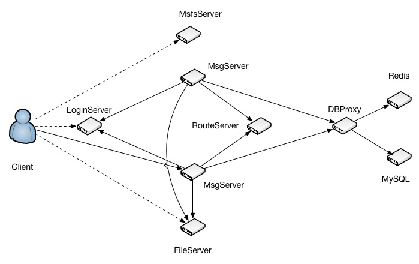

[toc]

## 一、简介

TeamTalk是一套开源的企业办公即时通讯软件，作为整套系统的组成部分之一，TTServer 为 TeamTalk 客户端提供用户登录，消息转发及存储等基础服务。

TTServer主要包含了以下几种服务器:

- LoginServer (C++): 登录服务器，分配一个负载小的MsgServer给客户端使用
- MsgServer (C++):  消息服务器，提供客户端大部分信令处理功能，包括私人聊天、群组聊天等
- RouteServer (C++):  路由服务器，为登录在不同MsgServer的用户提供消息转发功能
- FileServer (C++): 文件服务器，提供客户端之间得文件传输服务，支持在线以及离线文件传输
- MsfsServer (C++): 图片存储服务器，提供头像，图片传输中的图片存储服务
- DBProxy (JAVA): 数据库代理服务器，提供mysql以及redis的访问服务，屏蔽其他服务器与mysql与redis的直接交互

## 二、当前支持的功能点

- 私人聊天
- 群组聊天
- 文件传输
- 多点登录
- 组织架构设置.

## 三、系统架构图

- 登录服务器
  - 客户端通过登录服务器完成登录验证，获得一系列服务端地址
  - 登录服务器与消息服务器交互

- 图片服务器只与客户端交互
  - 客户端将图片上传到图片服务器，图片服务器返回图片链接地址

- 文件服务器可与客户端、消息服务器交互
  - 客户端将文件上传到文件服务器，文件服务器返回文件链接地址
  - 客户端通过消息服务器与文件服务器进行交互，进行文件操作，比如删除文件
  - 为保证安全客户端不会直接向文件服务器发送删除文件请求
  - 消息服务器可能会根据设定逻辑自动进行文件操作

- 消息服务器
  - 执行业务逻辑最多的服务
  - 可以与客户端、登录服务器、文件服务器、数据库代理服务器直接交互
- 路由服务器
  - 主要的业务逻辑都在消息服务器执行，消息服务器可能有多个实例，当两个登录到不同消息服务器的用户产生交互时，需要通过路由服务器进行桥接

- 数据库代理服务器
  - 用于保护，确保对数据库的操作只能通过数据库代理服务进行
  - 数据库代理服务器的上游是消息服务器，下游是 redis、mysql 两种服务的若干实例
  - 数据库代理服务器可以直接与文件服务器交互
- 推送服务器
  - 负责发推送
  - 上游是消息服务器

- redis 服务器
  - 可以有多个

- mysql 服务器
  - 可以有多个

## 四、 后续可考虑的功能

- 协议加密
- 手机推送
- 其他合理的酷炫功能点

## 五、 C++编译

- 整体编译:可以运行src/目录下的build.sh脚本,例如: ./build.sh version 0.0.1
- 单个模块编译:进入各自的目录,然后执行make即可,注意:base模块需要优先编译

- 程序启动请使用run.sh脚本, 例如: ./run.sh start
- 程序重启请使用restart.sh脚本, 例如: ./restart.sh msg_server

- 部署方案详见https://github.com/mogutt/TTAutoDeploy 之IM_SERVER模块

## 六、java编译
- 编译整个项目可以运行与src同目录的packageproduct.sh, sh packageproduct.sh

- 程序启动可以运行与src同目录的startup.sh, sh startup.sh 10400(其中10400为绑定的端口号)

- 部署方案详见https://github.com/mogutt/TTAutoDeploy 之IM_SERVER模块
