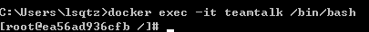
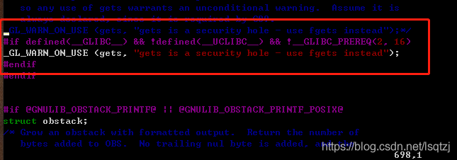
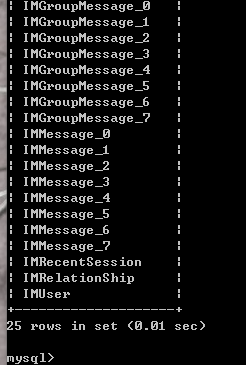
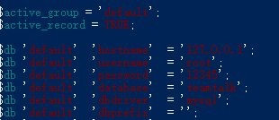
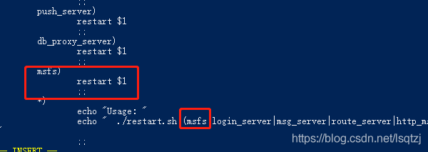
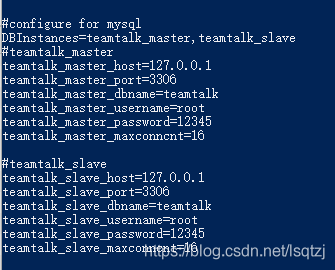
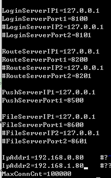
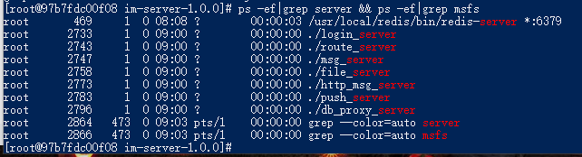
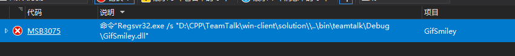
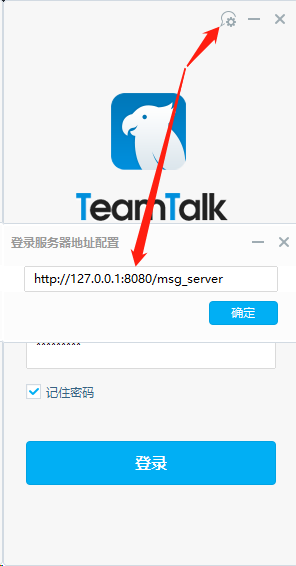

[TOC]

**说明**

TeamTalk https://github.com/mogujie/TeamTalk已经是停更6年的项目了，最近学习C++找到了这个项目，不过服务端只有linux版本的而且兼容不太好，centos7的版本是官方推荐的版本，安装完整的虚拟机系统感觉太麻烦，所以使用 [docker](https://so.csdn.net/so/search?q=docker&spm=1001.2101.3001.7020) 来部署，下面是操作过程记录。 

docker容器已经共享到[Docker Hub](https://hub.docker.com/r/lsqtzj/teamtalk) 不喜欢捣腾的可以直接运行测试

注意：官方的目前已经无法打开,可以在一下地址获取,下文用的是 Tags 2015 版本

[https://github.com/lsqtzj/TeamTalk](https://github.com/lsqtzj/TeamTalk)

[https://gitee.com/CyrusZHou/TeamTalk](https://gitee.com/CyrusZHou/TeamTalk)

# 1、运行docker centos:7 版本系统

```cobol
docker run -d -p 80:80 -p 8080:8080 -p 8008:8008 -p 8000:8000 -p 10600:10600 -p 8200:8200 -p 8400:8400 -p 8500:8500 -p 8600:8600 -p 8700:8700 -tid --name teamtalk --privileged=true centos:7 /sbin/init
```

这里开放的端口为服务端口后面需要使用。


##  1.1 进入 docker系统

```bash
docker exec -it teamtalk /bin/bash
```



## 1.2 更新系统 

```sql
yum update
```

## 1.3 安装依赖软件

```cobol
yum -y install net-tools initscripts wget vim git texinfo patch make cmake gcc gcc-c++ gcc-g77 flex bison file libtool libtool-libs autoconf kernel-devel libjpeg libjpeg-devel libpng libpng-devel libpng10 libpng10-devel gd gd-devel freetype freetype-devel libxml2 libxml2-devel zlib zlib-devel glib2 glib2-devel bzip2 bzip2-devel libevent libevent-devel ncurses ncurses-devel curl curl-devel e2fsprogs e2fsprogs-devel krb5 krb5-devel libidn libidn-devel openssl openssl-devel vim-minimal nano fonts-chinese gettext gettext-devel ncurses-devel gmp-devel pspell-devel unzip libcap diffutils
```


> 说明: 我自己是使用 Macmini + VMWare + Centos7 虚拟机运行的，需要额外做的事情有：
>
> 1. 要用 root 登陆， 登陆后先更新系统；
> 2. 网络设置为桥接模式； 
> 3. 为虚拟机分配双核心、25G硬盘、5120MB内存；
> 4. Centos7 安装后默认是没有打开网络的，需要首先打开网络配置然后重启网络；
> 5. 安装 VMWare Tools，并设置共享目录，用于将主机上相关文件复制到虚拟机；


# 2、安装MySQL 

## 2.1 下载解压mysql 

```cobol
wget https://downloads.mysql.com/archives/get/p/23/file/mysql-5.6.45.tar.gz
```

## 2.2 解压mysql 

```cobol
tar -zxvf mysql-5.6.45.tar.gz 
```

## 2.3 编译安装mysql

```cobol
cd mysql-5.6.45

cmake -DCMAKE_INSTALL_PREFIX=/usr/local/mysql -DEXTRA_CHARSETS=all -DDEFAULT_CHARSET=utf8 -DDEFAULT_COLLATION=utf8_general_ci -DWITH_READLINE=1 -DWITH_SSL=system -DWITH_ZLIB=system -DWITH_EMBEDDED_SERVER=1 -DENABLED_LOCAL_INFILE=1

make -j 2 && make install
```

## 2.3 创建mysql用户

```cobol
groupadd mysql

useradd -s /sbin/nologin -M -g mysql mysql
```

## 2.4 创建my.cnf配置

```cobol
vim /etc/my.cnf
      
# Example MySQL config file for medium systems.
# The following options will be passed to all MySQL clients
[client]
#password   = your_password
port        = 3306
socket      = /tmp/mysql.sock
default-character-set=utf8mb4

# Here follows entries for some specific programs
# The MySQL server

[mysqld]
bind-address = 127.0.0.1
port         = 3306
socket       = /tmp/mysql.sock
datadir = /usr/local/mysql/var
collation-server = utf8mb4_general_ci
character-set-server = utf8mb4
skip-external-locking
key_buffer_size = 16M
max_allowed_packet = 1M
table_open_cache = 64
sort_buffer_size = 512K
net_buffer_length = 8K
read_buffer_size = 256K
read_rnd_buffer_size = 512K
myisam_sort_buffer_size = 8M

# Replication Master Server (default)
# binary logging is required for replication
log-bin=mysql-bin

# binary logging format - mixed recommended
binlog_format=mixed

# required unique id between 1 and 2^32 - 1
# defaults to 1 if master-host is not set
# but will not function as a master if omittedserver-id   = 1

# Uncomment the following if you are using InnoDB tablesinnodb_data_home_dir = /usr/local/mysql/varinnodb_data_file_path = ibdata1:10M:autoextendinnodb_log_group_home_dir = /usr/local/mysql/var

# You can set .._buffer_pool_size up to 50 - 80 %
# of RAM but beware of setting memory usage too highinnodb_buffer_pool_size = 16Minnodb_additional_mem_pool_size = 2M
# Set .._log_file_size to 25 % of buffer pool sizeinnodb_log_file_size = 5Minnodb_log_buffer_size = 8Minnodb_flush_log_at_trx_commit = 1
innodb_lock_wait_timeout = 50

[mysqldump]
quickmax_allowed_packet = 16M

[mysql]
no-auto-rehash

# Remove the next comment character if you are not familiar with SQL
#safe-updatesdefault-character-set=utf8mb4

[myisamchk]
key_buffer_size = 20Ms
ort_buffer_size = 20M
read_buffer = 2M
write_buffer = 2M

[mysqlhotcopy]
interactive-timeout
```

##  2.5 初始化

```cobol
/usr/local/mysql/scripts/mysql_install_db --defaults-file=/etc/my.cnf --basedir=/usr/local/mysql --datadir=/usr/local/mysql/var --user=mysql

chown -R mysql /usr/local/mysql/var

chgrp -R mysql /usr/local/mysql/.

cp support-files/mysql.server /etc/init.d/mysql

chmod 755 /etc/init.d/mysql
```

## 2.6 其他配置

```cobol
vim /etc/ld.so.conf.d/mysql.conf
```

内容：

```cobol
/usr/local/mysql/lib
/usr/local/lib
```

应用配置

```undefined
ldconfig

ln -s /usr/local/mysql/lib/mysql /usr/lib/mysql

ln -s /usr/local/mysql/include/mysql /usr/include/mysql

ln -s /usr/local/mysql/bin/mysql /usr/bin/mysql

ln -s /usr/local/mysql/bin/mysqldump /usr/bin/mysqldump

ln -s /usr/local/mysql/bin/myisamchk /usr/bin/myisamchk

ln -s /usr/local/mysql/bin/mysqld_safe /usr/bin/mysqld_safe
```

## 2.7 启动mysql

```cobol
/etc/init.d/mysql start
```

## 2.8 修改密码

空密码登录

```undefined
mysql -uroot
```

 sql命令

```sql
use mysql;

update user set password=password('12345') where user='root';

flush privileges;

exit
```

新密码登录 

```cobol
mysql -uroot -p12345
```

## 2.9 完成mysql安装退回上级目录

```bash
exit
cd ../
```

# 3、安装PHP5.3.28

## 3.1 安装libiconv依赖

### 3.1.1 下载解压libiconv

```cobol
wget http://ftp.gnu.org/pub/gnu/libiconv/libiconv-1.14.tar.gz

tar -zxvf libiconv-1.14.tar.gz

cd libiconv-1.14
```

### 3.1.2 修改srclib/stdio.in.h文件

避免error: ‘gets’

```cobol
In file included from progname.c:26:0:
./stdio.h:1010:1: error: ‘gets’ undeclared here (not in a function)
 _GL_WARN_ON_USE (gets, "gets is a security hole - use fgets instead");
vim srclib/stdio.in.h
```

 注释**698 行，添加如下3行：**

```cobol
#if defined(__GLIBC__) && !defined(__UCLIBC__) && !__GLIBC_PREREQ(2, 16)
_GL_WARN_ON_USE (gets, "gets is a security hole - use fgets instead");
#endif
```

 

### 3.1.3 编译安装libiconv

```cobol
./configure

make -j 2 && make install

cd ..
```

## 3.2 安装libmcrypt依赖

```cobol
wget https://sourceforge.net/projects/mcrypt/files/Libmcrypt/2.5.8/libmcrypt-2.5.8.tar.gz

tar -zxvf libmcrypt-2.5.8.tar.gz

cd libmcrypt-2.5.8/

./configure

make && make install

ldconfig

cd libltdl/

./configure --enable-ltdl-install

make && make install

cd ../../
```

## 3.3 安装mhash依赖

```cobol
wget https://sourceforge.net/projects/mhash/files/latest/download/mhash-0.9.9.9.tar.gz

// 运行下面的命令会报错说文件格式不是zip，实际操作是用gui解压的
tar -zxvf mhash-0.9.9.9.tar.gz

cd mhash-0.9.9.9

./configure

make -j 2 && make install

cd ../
```

##  3.4 下载PHP5.3.28

```cobol
wget https://www.php.net/distributions/php-5.3.28.tar.gz
```

## 3.5 解压编译安装PHP

```cobol
tar -zxvf php-5.3.28.tar.gz

cd php-5.3.28

./configure --prefix=/usr/local/php --with-config-file-path=/usr/local/php/etc --enable-fpm --with-fpm-user=www --with-fpm-group=www --with-mysql=mysqlnd --with-mysqli=mysqlnd --with-pdo-mysql=mysqlnd --with-iconv-dir --with-freetype-dir --with-jpeg-dir --with-png-dir --with-zlib --with-libxml-dir=/usr --enable-xml --disable-rpath --enable-magic-quotes --enable-safe-mode --enable-bcmath --enable-shmop --enable-sysvsem --enable-inline-optimization --with-curl --enable-mbregex --enable-mbstring --with-mcrypt --enable-ftp --with-gd --enable-gd-native-ttf --with-openssl --with-mhash --enable-pcntl --enable-sockets --with-xmlrpc --enable-zip --enable-soap --without-pear --with-gettext --disable-fileinfo

make -j 2 ZEND_EXTRA_LIBS='-liconv' && make install
```

## 3.6 配置PHP 

```cobol
cp php.ini-production /usr/local/php/etc/php.ini

sed -i 's/post_max_size = 8M/post_max_size = 50M/g' /usr/local/php/etc/php.ini

sed -i 's/upload_max_filesize = 2M/upload_max_filesize = 50M/g' /usr/local/php/etc/php.ini

sed -i 's/;date.timezone =/date.timezone = PRC/g' /usr/local/php/etc/php.ini

sed -i 's/short_open_tag = Off/short_open_tag = On/g' /usr/local/php/etc/php.ini

sed -i 's/; cgi.fix_pathinfo=1/cgi.fix_pathinfo=0/g' /usr/local/php/etc/php.ini

sed -i 's/; cgi.fix_pathinfo=0/cgi.fix_pathinfo=0/g' /usr/local/php/etc/php.ini

sed -i 's/;cgi.fix_pathinfo=1/cgi.fix_pathinfo=0/g' /usr/local/php/etc/php.ini

sed -i 's/max_execution_time = 30/max_execution_time = 300/g' /usr/local/php/etc/php.ini

sed -i 's/register_long_arrays = On/;register_long_arrays = On/g' /usr/local/php/etc/php.ini

sed -i 's/magic_quotes_gpc = On/;magic_quotes_gpc = On/g' /usr/local/php/etc/php.ini

sed -i 's/disable_functions =.*/disable_functions = passthru,exec,system,chroot,scandir,chgrp,chown,shell_exec,proc_open,proc_get_status,ini_alter,ini_restore,dl,openlog,syslog,readlink,symlink,popepassthru,stream_socket_server/g' /usr/local/php/etc/php.ini

ln -s /usr/local/php/bin/php /usr/bin/php

ln -s /usr/local/php/bin/phpize /usr/bin/phpize

ln -s /usr/local/php/sbin/php-fpm /usr/bin/php-fpm

cd ..
```

## 3.7 安装ZendGuardLoader

```cobol
mkdir -p /usr/local/zend/

wget http://downloads.zend.com/guard/5.5.0/ZendGuardLoader-php-5.3-linux-glibc23-x86_64.tar.gz

tar -zxvf ZendGuardLoader-php-5.3-linux-glibc23-x86_64.tar.gz

cp ZendGuardLoader-php-5.3-linux-glibc23-x86_64/php-5.3.x/ZendGuardLoader.so /usr/local/zend/
```

## 3.8 编辑php.ini 

```cobol
vim  /usr/local/php/etc/php.ini
```

最后添加如下内容： 

```cobol
[Zend Optimizer]
zend_extension=/usr/local/zend/ZendGuardLoader.so
zend_loader.enable=1
zend_loader.disable_licensing=0
zend_loader.obfuscation_level_support=3
zend_loader.license_path=
```

## 3.9 创建php-fpm.conf

```cobol
vim /usr/local/php/etc/php-fpm.conf
```

内容：

```cobol
[global]
pid = /usr/local/php/var/run/php-fpm.pid
error_log = /usr/local/php/var/log/php-fpm.log
log_level = notice

[www]
listen = /tmp/php-cgi.sock
listen.backlog = -1
listen.allowed_clients = 127.0.0.1
listen.owner = www
listen.group = www
listen.mode = 0666
user = www
group = www
pm = dynamic
pm.max_children = 10
pm.start_servers = 2
pm.min_spare_servers = 1
pm.max_spare_servers = 6
request_terminate_timeout = 100
request_slowlog_timeout = 0
slowlog = var/log/slow.log
```

## 3.10 创建php-fpm启动脚本

```cobol
vim /etc/init.d/php-fpm
```

内容：

```bash
#! /bin/sh
 
### BEGIN INIT INFO
# Provides:          php-fpm
# Required-Start:    $remote_fs $network
# Required-Stop:     $remote_fs $network
# Default-Start:     2 3 4 5
# Default-Stop:      0 1 6
# Short-Description: starts php-fpm
# Description:       starts the PHP FastCGI Process Manager daemon
### END INIT INFO
prefix=/usr/local/php
exec_prefix=${prefix}
php_fpm_BIN=${exec_prefix}/sbin/php-fpm
php_fpm_CONF=${prefix}/etc/php-fpm.conf
php_fpm_PID=${prefix}/var/run/php-fpm.pid
php_opts="--fpm-config $php_fpm_CONF --pid $php_fpm_PID"
 
wait_for_pid () {
        try=0
        while test $try -lt 35 ; do
                case "$1" in
                        'created')
                        if [ -f "$2" ] ; then
                                try=''
                                break
                        fi
                        ;;
                        'removed')
                        if [ ! -f "$2" ] ; then
                                try=''
                                break
                        fi
                        ;;
                esac
                echo -n .
                try=`expr $try + 1`
                sleep 1
        done
}
 
case "$1" in
        start)
                echo -n "Starting php-fpm "
                $php_fpm_BIN --daemonize $php_opts
                if [ "$?" != 0 ] ; then
                        echo " failed"
                        exit 1
                fi
                wait_for_pid created $php_fpm_PID
 
                if [ -n "$try" ] ; then
                        echo " failed"
                        exit 1
                else
                        echo " done"
                fi
        ;;
        stop)
                echo -n "Gracefully shutting down php-fpm "
 
                if [ ! -r $php_fpm_PID ] ; then
                        echo "warning, no pid file found - php-fpm is not running ?"
                        exit 1
                fi
 
                kill -QUIT `cat $php_fpm_PID`
 
                wait_for_pid removed $php_fpm_PID
 
                if [ -n "$try" ] ; then
                        echo " failed. Use force-quit"
                        exit 1
                else
                        echo " done"
                fi
        ;;
 
        force-quit)
                echo -n "Terminating php-fpm "
 
                if [ ! -r $php_fpm_PID ] ; then
                        echo "warning, no pid file found - php-fpm is not running ?"
                        exit 1
                fi
                kill -TERM `cat $php_fpm_PID`
                wait_for_pid removed $php_fpm_PID
 
                if [ -n "$try" ] ; then
                        echo " failed"
                        exit 1
                else
                        echo " done"
                fi
        ;;
        restart)
                $0 stop
                $0 start
        ;;
        reload)
                echo -n "Reload service php-fpm "
                if [ ! -r $php_fpm_PID ] ; then
                        echo "warning, no pid file found - php-fpm is not running ?"
                        exit 1
                fi
                kill -USR2 `cat $php_fpm_PID`
 
                echo " done"
        ;;
        *)
                echo "Usage: $0 {start|stop|force-quit|restart|reload}"
                exit 1
        ;;
 
esac
```

授权 

```cobol
chmod +x /etc/init.d/php-fpm
```

## 3.11 启动php-fpm 

```cobol
groupadd www

useradd -s /sbin/nologin -g www www

/etc/init.d/php-fpm start
```

## 3.12 开机启动

```cobol
 vim /etc/systemd/system/php-fpm.service
```

内容：

```cobol
[Unit]
Description=php-fpm
After=network.target
      
[Service]
Type=forking
ExecStart=/etc/init.d/php-fpm
PrivateTmp=true
User=www
Group=www

[Install]
WantedBy=multi-user.target
```


```
systemctl enable php-fpm.service
```


# 4、安装nginx

## 4.1 安装pcre依赖

```cobol
wget https://sourceforge.net/projects/pcre/files/pcre/8.39/pcre-8.39.tar.bz2

tar -jxvf pcre-8.39.tar.bz2

cd pcre-8.39

./configure

make -j 2 && make install 

cd ..
```

## 4.2 下载nginx

```cobol
wget http://mirrors.sohu.com/nginx/nginx-1.6.0.tar.gz
```

## 4.3 解压编译安装

```cobol
tar -zxvf nginx-1.6.0.tar.gz

cd nginx-1.6.0

./configure --user=www --group=www --prefix=/usr/local/nginx --with-http_stub_status_module --with-http_ssl_module --with-http_gzip_static_module --with-ipv6

make -j 2 && make install

cd ..

ln -s /usr/local/nginx/sbin/nginx /usr/bin/nginx
```

## 4.4 配置nginx

```cobol
rm -f /usr/local/nginx/conf/nginx.conf

vim /usr/local/nginx/conf/nginx.conf
```

内容:

```cobol
user  www www;
worker_processes auto;

error_log  /home/wwwlogs/nginx_error.log  crit;
pid        /usr/local/nginx/logs/nginx.pid;

#Specifies the value for maximum file descriptors that can be opened by this process.
worker_rlimit_nofile 51200;

events {
    use epoll;
    worker_connections 51200;
    multi_accept on;
}


http {
    include       mime.types;
    default_type  application/octet-stream;
    server_names_hash_bucket_size 128;
    client_header_buffer_size 32k;
    large_client_header_buffers 4 32k;
    client_max_body_size 50m;
    sendfile on;
    tcp_nopush     on;
    keepalive_timeout 60;
    tcp_nodelay on;
    fastcgi_connect_timeout 300;
    fastcgi_send_timeout 300;
    fastcgi_read_timeout 300;
    fastcgi_buffer_size 64k;
    fastcgi_buffers 4 64k;
    fastcgi_busy_buffers_size 128k;
    fastcgi_temp_file_write_size 256k;

    gzip on;
    gzip_min_length  1k;
    gzip_buffers     4 16k;
    gzip_http_version 1.0;
    gzip_comp_level 2;
    gzip_types       text/plain application/x-javascript text/css application/xml;

    gzip_vary on;
    gzip_proxied        expired no-cache no-store private auth;
    gzip_disable        "MSIE [1-6]\.";

    server_tokens off;


    #log_format  access  '$remote_addr - $remote_user [$time_local] "$request" ''$status $body_bytes_sent "$http_referer" ''"$http_user_agent" $http_x_forwarded_for';

    log_format  access  '$remote_addr - $remote_user [$time_local] "$request" '
                        '$status $body_bytes_sent "$http_referer" '
                        '"$http_user_agent" $http_x_forwarded_for "$upstream_addr" "$upstream_response_time" $request_time $content_length';

    server {
        listen       80;
        server_name localhost;
        index index.html index.htm index.php default.html default.htm default.php;
        root        /home/wwwroot/default;

        location ~ \.php($|/) {
            fastcgi_pass   unix:/tmp/php-cgi.sock;
            fastcgi_index  index.php;
            fastcgi_split_path_info ^(.+\.php)(.*)$;
            fastcgi_param   PATH_INFO $fastcgi_path_info;
            fastcgi_param  SCRIPT_FILENAME  $document_root$fastcgi_script_name;
            include        fastcgi_params;
        }

        location ~ .*\.(gif|jpg|jpeg|png|bmp|swf)$ {
            expires      30d;
        }


        location ~ .*\.(js|css)?$ {
            expires      12h;
        }


        if (!-e $request_filename) {
            rewrite ^/(.*)$ /index.php/$1 last;
            break;
        }
    }
}
```

## 4.5 配置目录权限

```cobol
mkdir -p /home/wwwroot/default
chmod +w /home/wwwroot/default
mkdir -p /home/wwwlogs
chmod 777 /home/wwwlogs
chown -R www:www /home/wwwroot/default
```

## 4.6 创建nginx启动脚本

```cobol
vim /etc/init.d/nginx
```

内容：

```cobol
#!/bin/sh
# chkconfig: 2345 55 25
# Description: Startup script for nginx webserver on Debian. Place in /etc/init.d and
# run 'update-rc.d -f nginx defaults', or use the appropriate command on your
# distro. For CentOS/Redhat run: 'chkconfig --add nginx'
### BEGIN INIT INFO# Provides:          nginx
# Required-Start:    $all
# Required-Stop:     $all
# Default-Start:     2 3 4 5
# Default-Stop:      0 1 6
# Short-Description: starts the nginx web server# Description:       starts nginx using start-stop-daemon
### END INIT INFO
# Author:   licess
# website:  http://lnmp.org


PATH=/usr/local/sbin:/usr/local/bin:/sbin:/bin:/usr/sbin:/usr/bin
NAME=nginx
NGINX_BIN=/usr/local/nginx/sbin/$NAME
CONFIGFILE=/usr/local/nginx/conf/$NAME.conf
PIDFILE=/usr/local/nginx/logs/$NAME.pid
SCRIPTNAME=/etc/init.d/$NAME

case "$1" in
    start)
        echo -n "Starting $NAME... "
        if netstat -tnpl | grep -q nginx;
        then
            echo "$NAME (pid `pidof $NAME`) already running."
            exit 1
        fi

        $NGINX_BIN -c $CONFIGFILE

        if [ "$?" != 0 ]; 
        then
            echo " failed"
            exit 1
        else
            echo " done"
        fi
        ;;

    stop)
        echo -n "Stoping $NAME... "
        if ! netstat -tnpl | grep -q nginx; 
        then
            echo "$NAME is not running."
            exit 1
        fi

        $NGINX_BIN -s stop

        if [ "$?" != 0 ];
        then
            echo " failed. Use force-quit"
            exit 1
        else
            echo " done"
        fi
        ;;

    status)
        if netstat -tnpl | grep -q nginx;
        then
            PID=`pidof nginx`
            echo "$NAME (pid $PID) is running..."
        else
            echo "$NAME is stopped"
            exit 0
        fi
        ;;

    force-quit)
        echo -n "Terminating $NAME... "

        if ! netstat -tnpl | grep -q nginx; 
        then
            echo "$NAME is not running."
            exit 1
        fi

        kill `pidof $NAME`

        if [ "$?" != 0 ]; 
        then
            echo " failed"
            exit 1
        else
            echo " done"
        fi
        ;;

    restart)
        $SCRIPTNAME stop
        sleep 1
        $SCRIPTNAME start
        ;;

    reload)
        echo -n "Reload service $NAME... "
        if netstat -tnpl | grep -q nginx; 
        then 
            $NGINX_BIN -s reload
            echo " done"
        else
            echo "$NAME is not running, can't reload."
            exit 1
        fi
        ;;

    configtest)
        echo -n "Test $NAME configure files... "
        $NGINX_BIN -t
        ;;

    *)
        echo "Usage: $SCRIPTNAME {start|stop|force-quit|restart|reload|status|configtest}"
        exit 1
        ;;
esac
```

授权

```cobol
chmod +x /etc/init.d/nginx
```

# 5、安装redis

## 5.1 下载解压编译安装

```cobol
wget http://download.redis.io/releases/redis-2.8.19.tar.gz

tar -zxvf redis-2.8.19.tar.gz

cd redis-2.8.19

make PREFIX=/usr/local/redis install
```

## 5.2 配置redis

```cobol
mkdir -p /usr/local/redis/etc/

cp redis.conf  /usr/local/redis/etc/redis.conf

sed -i 's/daemonize no/daemonize yes/g' /usr/local/redis/etc/redis.conf

cd ..
```

## 5.3 创建启动文件

```cobol
vim /etc/init.d/redis
```

内容

```bash
#! /bin/bash

## redis - this script starts and stops the redis-server daemon

## chkconfig:    2345 80 90
# description:  Redis is a persistent key-value database##

## BEGIN INIT INFO
# Provides:          redis
# Required-Start:    $syslog
# Required-Stop:     $syslog# Should-Start:        $local_fs# Should-Stop:        $local_fs
# Default-Start:     2 3 4 5
# Default-Stop:      0 1 6
# Short-Description:    redis-server daemon
# Description:        redis-server daemon
### END INIT INFO

# chkconfig:   2345 90 10
# description:  Redis is a persistent key-value database


REDISPORT=6379

EXEC=/usr/local/redis/bin/redis-server

REDIS_CLI=/usr/local/redis/bin/redis-cli

PIDFILE=/var/run/redis.pid

CONF="/usr/local/redis/etc/redis.conf"


case "$1" in
    start)
        if [ -f $PIDFILE ]
        then
            echo "$PIDFILE exists, process is already running or crashed"
        else
            echo "Starting Redis server..."
            $EXEC $CONF
        fi

        if [ "$?"="0" ]
        then
            echo "Redis is running..."
        fi
        ;;

    stop)
        if [ ! -f $PIDFILE ]
        then
            echo "$PIDFILE does not exist, process is not running"
        else
            PID=$(cat $PIDFILE)
            echo "Stopping ..."
            $REDIS_CLI -p $REDISPORT shutdown

            while [ -x ${PIDFILE} ]
            do
                echo "Waiting for Redis to shutdown ..."
                sleep 1
            done

            echo "Redis stopped"
        fi
        ;;

   restart)
        ${0} stop
        ${0} start
        ;;

  *)  
    echo "Usage: /etc/init.d/redis {start|stop|restart}" >&2
    exit 1

esac
```

##  5.4 授权

```cobol
chmod +x /etc/init.d/redis
```

## 5.5 启动redis 

```cobol
/etc/init.d/redis start
```

# 6、设置开机启动

```cobol
chkconfig --level 345 php-fpm on

chkconfig --level 345 nginx on

chkconfig --level 345 mysql on

chkconfig --level 345 redis on
```

# 7、安装编译环境

## 7.1 下载解压编译安装gcc

```cobol
wget http://ftp.tsukuba.wide.ad.jp/software/gcc/releases/gcc-4.9.2/gcc-4.9.2.tar.gz

tar -zxvf gcc-4.9.2.tar.gz

cd gcc-4.9.2

./contrib/download_prerequisites 

mkdir gcc-build-4.9.2

cd gcc-build-4.9.2

../configure --prefix=/usr -enable-checking=release -enable-languages=c,c++ -disable-multilib

make -j 2 && make install

cd ../../
```

上面的版本太老，不支持c17特性，所以直接通过yum安装

```
// 查看当前gcc版本号
rpm -q gcc
gcc-4.8.5-44.el7.x86_64

// 删除老版本
rpm -e gcc-4.8.5-44.el7.x86_64
rpm -e gcc-c++-4.8.5-44.el7.x86_64
rpm -e libtool-2.4.2-22.el7_3.x86_64
rpm -e gcc-4.8.5-44.el7.x86_64

// 验证卸载
[root@localhost Downloads]# gcc -v
bash: gcc: command not found...
[root@localhost Downloads]# g++ -v
bash: g++: command not found...
[root@localhost Downloads]# 

// 安装第11版
在系统中安装存储库
yum install centos-release-scl

安装gcc和g++包（注意版本号：11版）
yum install -y devtoolset-11-gcc devtoolset-11-gcc-c++

配置安装好的包（注意版本号：11版）
scl enable devtoolset-11 bash


验证安装
[root@123 /]# gcc -v
COLLECT_GCC=gcc
COLLECT_LTO_WRAPPER=/opt/rh/devtoolset-11/root/usr/libexec/gcc/x86_64-redhat-linux/11/lto-wrapper
Target: x86_64-redhat-linux
Configured with: ../configure --enable-bootstrap --enable-languages=c,c++,fortran,lto --prefix=/opt/rh/devtoolset-11/root/usr --mandir=/opt/rh/devtoolset-11/root/usr/share/man --infodir=/opt/rh/devtoolset-11/root/usr/share/info --with-bugurl=http://bugzilla.redhat.com/bugzilla --enable-shared --enable-threads=posix --enable-checking=release --enable-multilib --with-system-zlib --enable-__cxa_atexit --disable-libunwind-exceptions --enable-gnu-unique-object --enable-linker-build-id --with-gcc-major-version-only --with-linker-hash-style=gnu --with-default-libstdcxx-abi=gcc4-compatible --enable-plugin --enable-initfini-array --with-isl=/builddir/build/BUILD/gcc-11.2.1-20220127/obj-x86_64-redhat-linux/isl-install --enable-gnu-indirect-function --with-tune=generic --with-arch_32=x86-64 --build=x86_64-redhat-linux
Thread model: posix
Supported LTO compression algorithms: zlib
gcc version 11.2.1 20220127 (Red Hat 11.2.1-9) (GCC) 

[root@123 /]# g++ -v
Using built-in specs.
COLLECT_GCC=g++
COLLECT_LTO_WRAPPER=/opt/rh/devtoolset-11/root/usr/libexec/gcc/x86_64-redhat-linux/11/lto-wrapper
Target: x86_64-redhat-linux
Configured with: ../configure --enable-bootstrap --enable-languages=c,c++,fortran,lto --prefix=/opt/rh/devtoolset-11/root/usr --mandir=/opt/rh/devtoolset-11/root/usr/share/man --infodir=/opt/rh/devtoolset-11/root/usr/share/info --with-bugurl=http://bugzilla.redhat.com/bugzilla --enable-shared --enable-threads=posix --enable-checking=release --enable-multilib --with-system-zlib --enable-__cxa_atexit --disable-libunwind-exceptions --enable-gnu-unique-object --enable-linker-build-id --with-gcc-major-version-only --with-linker-hash-style=gnu --with-default-libstdcxx-abi=gcc4-compatible --enable-plugin --enable-initfini-array --with-isl=/builddir/build/BUILD/gcc-11.2.1-20220127/obj-x86_64-redhat-linux/isl-install --enable-gnu-indirect-function --with-tune=generic --with-arch_32=x86-64 --build=x86_64-redhat-linux
Thread model: posix
Supported LTO compression algorithms: zlib
gcc version 11.2.1 20220127 (Red Hat 11.2.1-9) (GCC) 

配置环境变量
因为不配置环境变量的话，每打开一个客户端，就需要执行一次上面的第三步配置安装包

//先查看gcc和g++安装位置
[root@123 /]# which gcc
/opt/rh/devtoolset-11/root/usr/bin/gcc
[root@123 /]# which g++
/opt/rh/devtoolset-11/root/usr/bin/g++


重新加载文件
source /etc/profile


还要加两个软连接, 因为项目中会用到
ln -s /bin/cc /opt/rh/devtoolset-11/root/usr/bin/gcc
ln -s /bin/c++ /opt/rh/devtoolset-11/root/usr/bin/g++
```


## 7.2 下载解压编译安装termcap

```cobol
wget https://mirrors.sjtug.sjtu.edu.cn/gnu/termcap/termcap-1.3.1.tar.gz

tar -zxvf termcap-1.3.1.tar.gz

cd termcap-1.3.1

./configure --prefix=/usr

make -j 2 && make install

cd ..
```

## 7.3 下载解压编译安装 gdb

```cobol
wget http://ftp.gnu.org/gnu/gdb/gdb-7.9.tar.gz

tar -zxvf gdb-7.9.tar.gz

cd gdb-7.9

./configure --prefix=/usr

make -j 2 && make install

cd ..
```

## 7.4 下载解压编译安装 protobuf

```cobol
// wget https://github.com/google/protobuf/releases/download/v2.6.1/protobuf-2.6.1.tar.gz
wget https://github.com/protocolbuffers/protobuf/releases/download/v3.20.0/protobuf-cpp-3.20.0.tar.gz
      
tar -zxvf protobuf-cpp-3.20.0.tar.gz

cd protobuf-cpp-3.20.0/

./configure --prefix=/usr/local/protobuf

make -j 2 && make install

cd ..
```

# 8、安装TeamTalk

## 8.1 下载TeamTalk

```cobol
git clone https://github.com/mogujie/TeamTalk.git
```

## 8.2 生成pb文件

```cobol
mkdir -p TeamTalk/server/src/base/pb/lib/linux/

cp /usr/local/protobuf/lib/libprotobuf-lite.a TeamTalk/server/src/base/pb/lib/linux/

cp -r /usr/local/protobuf/include/* TeamTalk/server/src/base/pb/

cd TeamTalk/pb

export PATH=$PATH:/usr/local/protobuf/bin

export LD_LIBRARY_PATH=$LD_LIBRARY_PATH:/usr/local/protobuf/lib

sh create.sh

sh sync.sh
```

## 8.3 安装依赖

```bash
cd ../server/src
```

### 8.3.1 修改 make_log4cxx.sh

原有下载地址已经无效，需要修改一下文件下载地址,:

vim make_log4cxx.sh

```cobol
LOG4CXX_PATH=http://mirror.bit.edu.cn/apache/logging/log4cxx/0.10.0/$LOG4CXX.tar.gz
```

改成 

```cobol
//LOG4CXX_PATH=https://archive.apache.org/dist/logging/log4cxx/0.10.0/$LOG4CXX.tar.gz
LOG4CXX_PATH=https://archive.apache.org/dist/logging/log4cxx/0.12.1/$LOG4CXX.tar.gz
// 注意上面一行的版本号也要修改 
```

###  8.3.2 开始安装

```cobol
sh make_log4cxx.sh
   
// 运行上面的命令之后发生：CMake 3.13 or higher is required.  You are running version 2.8.12.2
// 于是升级cmake
// wget -c https://github.com/Kitware/CMake/releases/download/v3.27.1/cmake-3.27.1.tar.gz
// yum remove cmake -y
// tar -zxvf cmake-3.17.0-rc3.tar.gz && cd cmake-3.17.0-rc3
// ./configure --prefix=/usr/local/cmake
// gmake && gmake install
// ln -s /usr/local/cmake/bin/cmake /usr/bin/cmake
// vim /etc/profile
// export CMAKE_HOME=/usr/local/cmake
// export PATH=$PATH:$CMAKE_HOME/bin
// cmake --version
       
// 然后又有 boost报错， 于是运行下面的命令重装了boost
// yum install boost-devel
      
// 最后再执行一次 sh make_log4cxx.sh，安装成功
      
      

 
sh make_hiredis.sh
```

## 8.4 编译server

### 8.4.1 修改代码

1）因为mysql不是默认路径，所以修改db_proxy_server/CMakeList

vim db_proxy_server/CMakeLists.txt

```swift
SET(MYSQL_INCLUDE_DIR /usr/include/mysql)

SET(MYSQL_LIB /usr/lib64/mysql)
```

改成

```cobol
SET(MYSQL_INCLUDE_DIR /usr/local/mysql/include)

SET(MYSQL_LIB /usr/local/mysql/lib)
```

2）因为是测试环境只开了一个 DBServer 所以修改一下msg_server/msg_server.cpp 86行

vim msg_server/msg_server.cpp

```bash
if (db_server_count < 2) {
      log("DBServerIP need 2 instance at lest ");
      return 1;
}
```

改成

```cobol
 if (db_server_count < 1) {
      log("DBServerIP need 2 instance at lest ");
      return 1;
 }
```

###  8.4.2 开始编译

```cobol
// 1.删除第一行的cmake安装，否则又会安装一个版本低的
// 2.升级gcc 以支持c17
// 3.编译过程中 用到 /bin/cc /bin/c++， 于是生成了两个链接,
// which gcc
// /opt/rh/devtoolset-11/root/usr/bin/gcc
// which g++
// /opt/rh/devtoolset-11/root/usr/bin/g++
// ln -s /opt/rh/devtoolset-11/root/usr/bin/gcc /bin/cc
// ln -s /opt/rh/devtoolset-11/root/usr/bin/g++ /bin/c++
// 3. 继续编译，报错： mysql.h：No such file or directory
// 找到报错位置在 db_proxy_server/DBPool.h 中,
// 将 #include <mysql/mysql.h> 修改为 #include <mysql.h> 后通过编译
      
      
sh build.sh version 1.0.0
```

### 8.4.3 部署服务

```cobol
cd 


```

### 8.4.4 导入mysql

```cobol
mysql -uroot -p12345
source /home/TT/auto_setup/mariadb/conf/ttopen.sql;
show tables;
```

 




退出mysql

```php
exit
```

### 8.4.5 部署web

```cobol
cd /home/wwwroot/default
cp -rf ~/Downloads/TeamTalk/php/* /home/wwwroot/default
```

 修改config.php

```lua
vim application/config/config.php
```

修改18、19行

```php
$config['msfs_url'] = 'http://127.0.0.1:8700/';
$config['http_url'] = 'http://127.0.0.1:8400';
```

修改database.php 

 vim application/config/database.php

```cobol
$db['default']['hostname'] = '127.0.0.1';
$db['default']['username'] = 'root';
$db['default']['password'] = '12345';
$db['default']['database'] = 'teamtalk';
```

 




### 8.4.6 测试web

浏览器输入http://localhost/ 出现登录窗口说明部署成功，用户名：admin 密码：admin


登录可进行用户管理，注意：先创建组织架构，部门名称、部门优先级为必填项，接着再创建用户

### 8.4.7 运行服务

```cobol
cd ~/Downloads/TeamTalk/auto_setup/im-server-1.0.0
```

1）修改 restart.sh

```undefined
vi restart.sh
```

 db_proxy_server后添加

```typescript
msfs)
    restart $1
    ;;
```



复制配置文件

```cobol
cp /home/TT/auto_setup/im_server/conf/msfs.conf /home/TT/auto_setup/im-server-1.0.0/msfs/msfs.conf
```

2）修改 db_proxy_server/dbproxyserver.conf 配置

vim  db_proxy_server/dbproxyserver.conf

```bash

#teamtalk_master
teamtalk_master_host=127.0.0.1
teamtalk_master_port=3306
teamtalk_master_dbname=teamtalk
teamtalk_master_username=root
teamtalk_master_password=12345
teamtalk_master_maxconncnt=16

#teamtalk_slave
teamtalk_slave_host=127.0.0.1
teamtalk_slave_port=3306
teamtalk_slave_dbname=teamtalk
teamtalk_slave_username=root
teamtalk_slave_password=12345
teamtalk_slave_maxconncnt=16
```



3）局域网访问

修改 msg_server/msgserver.conf 最后的IpAdd1/IpAdd2 改成主机IP

```bash
vi msg_server/msgserver.conf
```



4）启动服务 

```cobol
./restart.sh login_server

./restart.sh route_server

./restart.sh msg_server

./restart.sh file_server

./restart.sh msfs

./restart.sh http_msg_server

./restart.sh push_server

./restart.sh db_proxy_server
```

5）查看服务运行情况

```perl
ps -ef|grep server && ps -ef|grep msfs
```

 

服务日志保存在每个服务文件夹下的log目录，如查看login_server的日志：

```cobol
cat /TeamTalk/auto_setup/im-server-1.0.0/login_server/log/default.log
```

6）服务说明

| **服务**        | **端口**  | **服务类型** | **说明**                                                     |
| --------------- | --------- | ------------ | ------------------------------------------------------------ |
| login_server    | 8080/8008 | http         | 登录服务器，提供msg_server,msfs服务地址以及端口号的，每次都会返回client连接数少的msg_server。具有负载均衡的作用，每次客户端打开都会向login_server发起一次请求获取msg_server的ip以及port，以此来连接msg_server，可以部署多个 |
| msg_server      | 8000      | tcp          | 消息服务器，维护所有的client连接，可以部署多个。将客户端发来的的行为消息转发给db_proxy_server， 每个msg_server都得连接到db_proxy_server。提供客户端大部分信令处理功能，包括私人聊天、群组聊天等 |
| db_proxy_server | 10600     | tcp          | 数据库代理服务器，即时通讯中大部分的业务逻辑都是在db_proxy_server中实现的 它主要是对mysql，redis数据库进行业务上的行为。可以部署多个，本身能并发处理业务。 |
| route_server    | 8200      | tcp          | 路由服务器，连接所有的msg_server 充当路由中转的服务。解决不同的msg_server之间client直接的通讯。 |
| http_msg_server | 8400      | http         | API服务，直接连接db_proxy_server 去进行业务上的处理，参考基本API的实现可以拓展一些其他的API，共业务上使用。 |
| push_server     | 8500      | tcp          | 消息推送服务，msg_server都会连接它，它配置并连接apple的推送接口以此来对ios设备进行消息推送 |
| file_server     | 8600      | tcp          | 文件服务器，提供客户端之间的文件传输服务，支持在线以及离线文件传输 |
| msfs            | 8700      | http         | 图片存储服务器，提供头像，图片传输中的图片存储服务           |

### 8.4.8 redis,php,nginx,mysql 服务管理

```cobol
/etc/init.d/redis {start|stop|restart}

/etc/init.d/php-fpm {start|stop|force-quit|restart|reload}

/etc/init.d/nginx {start|stop|force-quit|restart|reload|status|configtest}

/etc/init.d/mysql {start|stop|restart|reload|force-reload|status}  [ MySQL server options ]
```

### 8.4.9 win客户端编译

win客户端项目是使用 Visual Studio 2013 开发的，项目位置是teamtalk/win-client/solution/teamtalk.sln

我使用的是 Visual Studio 2019版本的，需要改一些些代码才可以编译通过。还有编译的时候要用管理员方式运行vs否则会提示出错：



### 8.4.10 win客户端登录





​	 	

> 在上述安装过程中，本人使用的是装有GUI的 CentOS， 服务部署完成后会发现无法进入图形界面，目前为了方便起见直接删除了用户界面，并将命令行登陆设置为了默认的登陆方式
